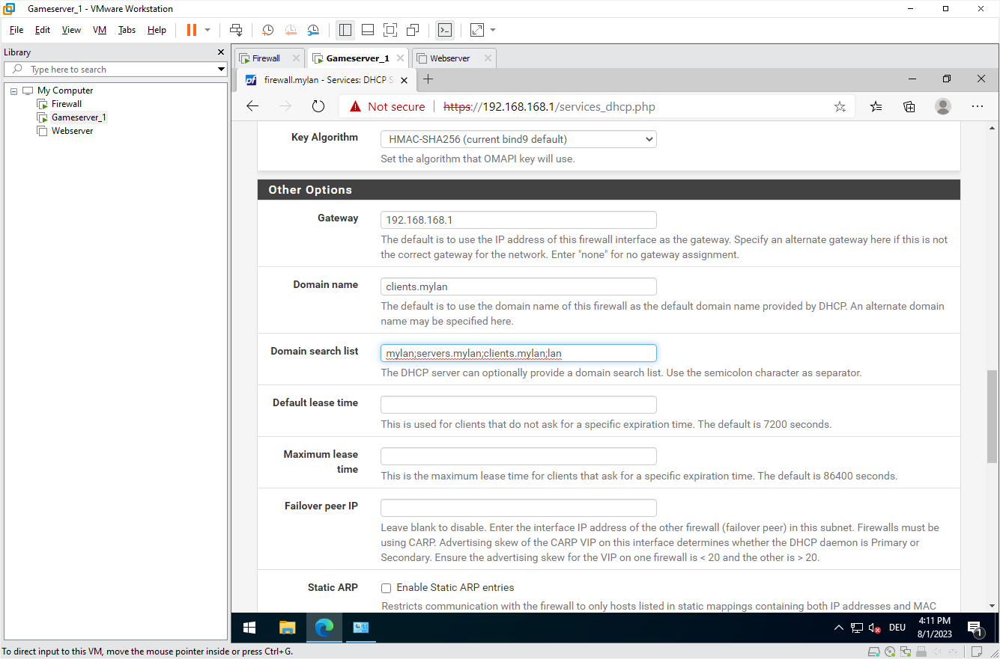
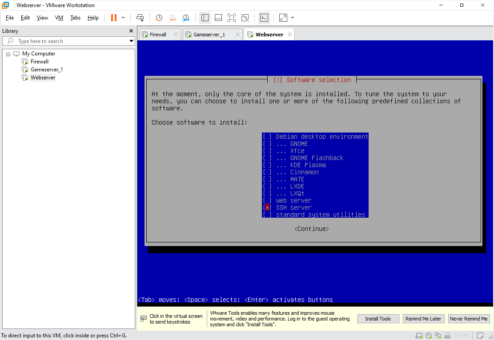
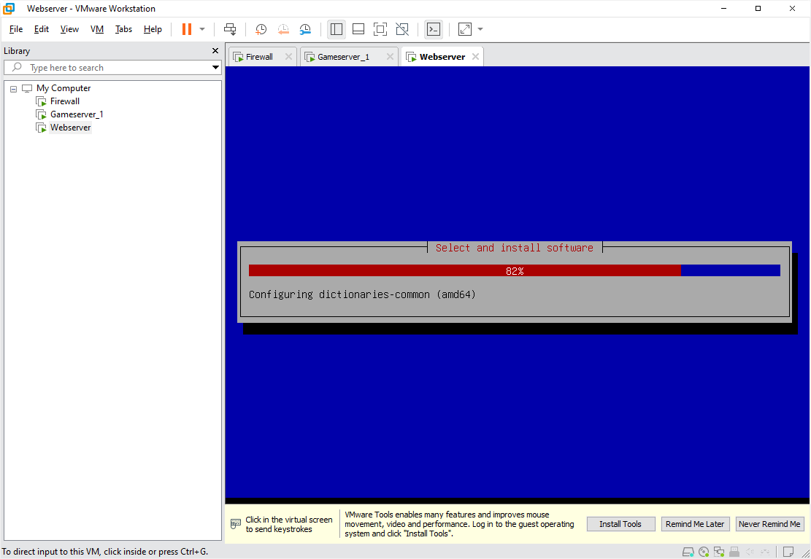
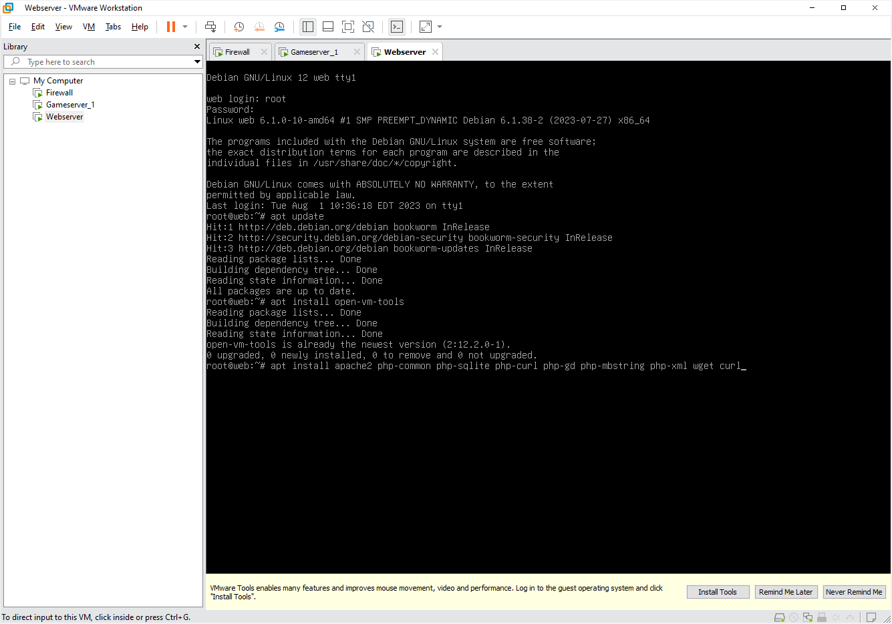
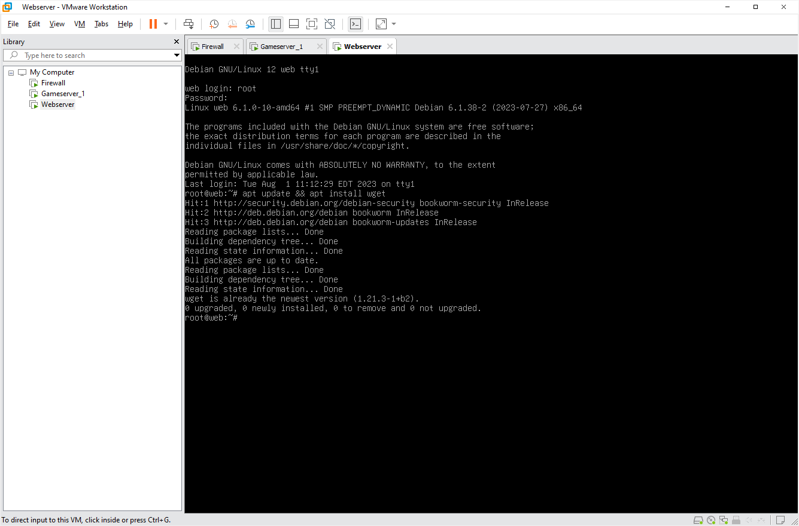
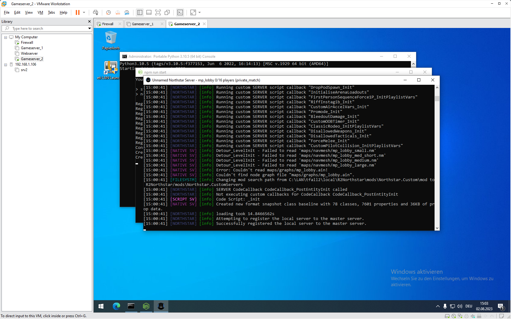

# eti LAN Guide
### Schritt für Schritt zu deinem eigenen LAN Party Server

Oft wurden wir gefragt: "Gibt es nicht eine Anleitung?" "Wie installiere ich das genau?" "Wie geht das nochmal mit diesem DNS?" Mit diesem Guide versuchen wir, einige der häufigsten Fragen zu beantworten. 

Du möchtest eine **LAN Party** veranstalten und weißt nicht, wo du anfangen sollst? Du hast schon Erfahrungen als Veranstalter und möchtest dein Setup nun optimieren und z.B. **Gameserver** bereit stellen? Dieser Guide kann dir helfen.

Bitte beachte, dass es sich bei dieser Anleitung um _einen möglichen_ Weg handelt. Es gibt mit Sicherheit noch bessere Ansätze oder bessere Software. Wir haben diese Anleitung jedoch so gestaltet, dass mit einem Minimum an Aufwand ein bestmögliches Ergebnis erreicht werden kann, ohne viele Einschränkungen zu schaffen. Wir versuchen dabei, die wichtigsten **Basics** zu vermitteln, die man für eine erfolgreiche LAN Party verinnerlicht haben sollte.

Diese Anleitung geht davon aus, dass du ein System einrichten möchtest, dass als **Server für deine LAN** dienen soll. Es ist erst einmal nicht so wichtig, ob diese Hardware schon bereit steht oder erst später beschafft werden soll. Sie muss lediglich **x86_64** -kompatibel sein. Wir nutzen im Folgenden die Software **VMware Workstation**, um virtuelle Server anzulegen und auszuführen. Es ist dir überlassen, welche Schritte du bearbeiten möchtest, welche Dienste du einrichten möchtest und wo deine **virtuellen Server** später ausgeführt werden. Im Detail erklären wir folgendes:

 
## Vorgehen
**1. Installation VMware Workstation**

Wir zeigen in diesem Tutorial, wie VMware Workstation unter Windows konfiguriert wird. Auf deinem Server muss also irgendeine Windows-Version installiert sein, damit du die folgenden Schritte abarbeiten kannst.

> Alternativ kann auch eine andere Virtualisierungsumgebung oder VMware ESXi genutzt werden. Die Wahl fiel unter anderem auch deshalb auf VMware Workstation, da hier die Möglichkeit besteht, die virtuellen Server später zu exportieren und mit wenigen Klicks anzupassen.

**2. Konfiguration virtueller Netzwerkkarten**
> Möchtest du auch einen Internetzugang ermöglichen? Dann benötigt deine Serverhardware später 2 physische Netzwerkkarten. Anderenfalls genügt auch eine einzelne. 

**3. Installation einer pfSense Firewall**
> Aufspannen deines LANs, mit DHCP-Server, DNS-Forwarder und optionaler Internetanbindung.

**4. Installation eines Gameservers**

**5. Installation von LANPage**

## Voraussetzungen
Diese Anleitung stellt keine allzu hohen Anforderungen an deine Hardware. Es hängt letztlich von deinem Konzept ab, wie viele virtuelle Server du benötigst und ausführen möchtest.  Wir können an dieser Stelle nur Empfehlungen aussprechen. Gehen wir beispielsweise davon aus, dass das Serversystem über folgende Ausstattung verfügt:

### Beispielhardware - alter Desktop PC
|Komponente|Produkt|Werte  
|-------|------|---------|
|CPU|Intel Core i5-2400|Cores: **4** Threads: **4**
|RAM|Samsung PC3-12800U|4 x **4 GB**
|Storage|Western Digital WD Red SSD|**1 TB**
|Storage|Seagate BarraCuda HDD|**2 TB**
|NIC|Realtek RTL8111E|10/100/**1000 Mbps**
|NIC|Broadcom BCM5751-T1|10/100/**1000 Mbps**
|Switch|D-Link DGS-108|8 Port

### Mögliche Ressourcenverteilung

> Diese Hardware würde schon eine halbwegs ansehnliche Ressourcenverteilung ermöglichen. Bitte beachte, dass es sich um ein individuelles Beispiel handelt und die Virtualisierungsebene bzw. das unter den VMs laufende Betriebssystem selbst auch ein paar Ressourcen benötigt.
> 
|VM|vCPUs|RAM|Storage|Typ|NIC|OS
|-------|------|---------|--------|-----|---|---|
|Firewall|1|1 GB|30 GB|SSD|2|pfSense (FreeBSD)
|Gameserver|2|8 GB|100 GB|SSD|1|Windows 10
|Sync Server|1|4 GB|2000 GB|HDD|1|Debian 12
|LANPage Webserver|1|0.5 GB|10 GB|HDD|1|Debian 12

## Vorbereitung

### Downloads
Für die nächsten Schritte benötigen wir einige Dateien, welche du schon einmal herunterladen kannst. Für die Testversionen von VMware ist unter Umständen eine Registrierung erforderlich - eine Wegwerf-Spamadresse genügt.

- VMware Workstation (Testversion): https://www.vmware.com/go/getworkstation-win
- pfSense (AMD64, DVD Image): https://www.pfsense.org/download
- Debian 12 (AMD64, Netinstaller): https://www.debian.org/download
- Windows 10 (64-Bit ISO Image): https://www.microsoft.com/de-de/software-download/windows10

Optional:
- Windows Server (64-Bit ISO Image): https://www.microsoft.com/de-DE/evalcenter/evaluate-windows-server-2022

### Installation VMware Workstation
Dieser Schritt gestaltet sich einfach: starte das soeben heruntergeladene VMware Workstation -Installationsprogramm und folge den Anweisungen.

Wenn du einen anderen Hypervisor verwenden möchtest (VMware ESXi, Hyper-V, VirtualBox, ...) kannst du die Installation überspringen. Achte darauf, dass deine Hardware mit dem Hypervisor kompatibel ist.

## Vorbereitung der Firewall-VM

Los geht's! In diesem Schritt erstellst du deinen ersten virtuellen Server: Eine Firewall. Die Firewall-VM kümmert sich um die Dienste DHCP sowie DNS und fungiert als Gateway für den Internetzugriff auf deiner LAN-Party (optional). Wir demonstrieren die Einrichtung anhand der Firewall-Distribution PFsense.

### Virtuellen Server erstellen ###

Öffne VMware Workstation und wähle über das Menü den Punkt _New Virtual Machine_ oder drücke _STRG + N_.

Konfiguriere die VM nun, wie auf den folgenden Screenshots zu sehen:

#### Hinweis ####
Es empfiehlt sich, das Kompatiblitätslevel möglichst niedrig anzusetzen, da sich die VM damit später leichter auf einen ESXi-Server oder einen anderen Hypervisor übertragen lässt.

Wähle im nächsten Schritt das bereits heruntergeladene _pfSense ISO-Image_ aus.

Gib der Firewall-VM einen passenden Namen. Die _Location_ stellt den Speicherort der VM auf deinem Server dar. In unserem Beispiel verwenden wir eine der SSDs.

Die CPU-Konfiguration ergibt sich aus den zur Verfügung stehenden Ressourcen des Servers. Wir folgen auf dem Screenshot nicht ganz der Berechnung zu unserer _Beispielhardware_.

### Netzwerkkonfiguration der VM ###

Belasse den Netzwerktyp zunächst bei der Standardeinstellung, in einem der nächsten Schritte konfigurieren wir zuerst die Netzwerke des Hypervisors.

### Datenträgerkonfiguration der VM ###

Die Voreinstellungen können unserer Ansicht nach beibehalten werden.

Erstelle eine virtuelle Festplatte entsprechend der Screenshots. Bei der Angabe von 30 GB handelt es um eine Empfehlung, sie darf selbstverständlich auch größer sein. Für die Firewall ist ein höherer Speicherplatzbedarf aber normalerweise nicht zu erwarten.

Wähle einen Speicherort für die virtuelle Festplatte. Normalerweise entspricht der Dateiname der Bezeichnung der VM und die VMDK-Datei wird im selben Verzeichnis abgelegt. Du solltest es hierbei belassen.

### Hardwareanpassungen ###

Fertig! Die VM ist nun vorkonfiguriert und du kannst nun weitere Anpassungen vornehmen. Eine Soundkarte wird für eine Firewall vermutlich nicht erforderlich sein. Benötigen werden wir jedoch eine weitere Netzwerkkarte.

Wähle hierzu _Add_ und _Network Adapter_.

Die VM ist nun bereit für den ersten Start und die Installation der Firewall-Software. Bevor wir damit weiter machen, passen wir aber zunächst die Netzwerkeinstellungen der VMware Workstation (des Hypervisors) an. 

Solltest du einen anderen Hypervisor wie KVM, Hyper-V oder Virtualbox verwenden, musst du die Adapterkonfiguration analog zu den folgenden Anweisungen dort nachbilden.

> Selbstverständlich ist die Netzwerkkonfiguration auch abhängig vom gewünschten Setup. Dieses Tutorial behandelt ein gut funktionierendes Basissetup mit Internetzugang. Soll überhaupt kein Internet verteilt werden? Dann genügt für ein Basissetup auch ein Netzwerkadapter. Soll eine Lastverteilung oder ein Failover-Setup realisiert werden? Gibt es VLANs? Das weißt du sicher am besten. 

### Netzwerkkonfiguration (Hypervisor) ###

Öffne den _Virtual Network Editor_ über das Menü _Edit_. Im Editor siehst du nun alle physischen und gegebenenfalls virtuelle Netzwerkkarten, die in deinem Server-Betriebssystem eingerichtet sind.

Wir gehen davon aus, dass eine Netzwerkkarte für _LAN_ konfiguriert wird und eine für _WAN_, also den Internetzugang. Hier kann beispielsweise eine Fritzbox, ein Kabelmodem oder ein LTE-Router angeschlossen werden.

> In VMware Workstation gibt es zwei grundlegende Netzwerkmodi: NAT (Network Address Translation) und Bridge (Brücke). Hier eine kurze Erklärung, was die beiden Modi unterscheidet:
> 
> ### NAT-Modus (Network Address Translation) ###
> 
> Hier erstellst du ein privates Netzwerk für die VMs.
> Die VMs teilen sich _eine_ IP-Adresse des Hosts, um Verbindungen nach Außen aufzubauen. Nach Außen heißt in dem Fall: zum Rest des LAN oder WAN.
> Gut, wenn von einander isolierte VMs oder Internetzugriff für VMs gewünscht sind und keine IP-Adressen im LAN benutzt werden sollen. Die Performance ist jedoch geringer und NAT bringt im Regelfall weitere Probleme mit sich. Der Netzwerkmodus ist ungeeignet für eine Firewall.

> ### Bridge-Modus (Brückenmodus) ###
> 
> Im Bridge-Modus benimmt sich die VM wie ein eigener, physischer Rechner im Netzwerk. 
> Die VM erhält über die zufallsgenerierte MAC-Adresse ihrer virtuellen Netzwerkkarte eine eigene IP-Adresse und kann direkt mit anderen Geräten sprechen. Nützlich, wenn eine nahtlose Integration der VMs ins Netzwerk gewünscht ist, sehr gute Performance.

### Virtual Network Editor ###

Wähle für die beiden zu verwendenden Netzwerkadapter den _Bridged_-Modus aus. Sollte eine deiner Netzwerkkarten nicht erkannt beziehungsweise aufgeführt werden, musst du sie im _ Windows Geräte-Manager_ überprüfen. Beende anschließend den _Virtuel Network Editor_ mit einem Klick auf _OK_.

### Netzwerkkonfiguration (Firewall VM) ###

Öffne mit einem Rechtsklick auf die VM unter dem Punkt _Settings_ erneut das Konfigurationsmenü der VM.

Wähle den oder die Netzwerkadapter aus und konfiguriere auch hier den _Bridged_-Modus.

### Zusammenfassung ###

Die Hardwareausstattung der VM sollte nun wie folgt aussehen:

Das sieht gut aus! Zeit für den ersten Boot! Wähle _Power on this virtual machine_.
 

Wenn alles richtig konfiguriert ist, solltest du nach kurzer Zeit den _pfSense Installer_ sehen können, der von dem in die VM eingehängten _ISO-Image_ geladen wurde.

## Installation Firewall ##

Die nächsten Schritte sind recht unspektakulär. Folge den Anweisungen des _pfSense Installers_ indem du die nächsten Punkte anhand der folgenden Screenshots abarbeitest. 

> Sollte sich heraus stellen, dass für die nächsten Teilschritte ausführliche Erklärungen erforderlich sind, werden wir sie nachpflegen.

Wähle _Accept_ durch einfaches Drücken der _Eingabetaste_ und im nächsten Menü anschließend _Install_ durch Bestätigung von _OK_.

### Installation starten ###

### Partitionierung ###

#### Bestätigung ####

In diesem Schritt bestätigst du noch einmal, dass die virtuelle Festplatte der Firewall-VM formatiert werden darf.

### Kopiervorgang ###

Keine Sorge, du merkst schon, wenn es brennt 😛 Abwarten und Tee trinken.

Wenn der Kopiervorgang abgeschlossen ist, wähle _Reboot_ um die VM neu zu starten.

## Konfiguration der Firewall ##

Wenn der Neustart der VM abgeschlossen ist, solltest du das _pfSense Wartungsmenü_ sehen können. Hier können und müssen wir zunächst eine grundlegende Konfiguration der Netzwerkkarten vornehmen.

Bisher spielte es noch keine Rolle, an welche der beiden Netzwerkkarten in deinem Server, die Netzwerkkabel zum LAN oder WAN angeschlossen sind. Das wird sich nun ändern.

### LAN-Interface ###
Wähle die Option _1_, um den virtuellen Netzwerkkarten IP-Adressen zuzuweisen.

Fangen wir mit dem _LAN-Interface_ an. In unserer Übersicht ist das NIC _em1_. Demnach muss _2_ ausgewählt werden, um _em1_ zu konfigurieren. 

Bei der Frage ob die Netzwerkkarte mit DHCP konfiguriert werden soll, wählen wir _n_, denn stattdessen wollen wir unsere Firewall IP-Adressen verteilen lassen.

### IP-Bereich festlegen ###

pfSense fragt daraufhin nach einer IP-Adresse für sich selbst und dem dazugehörigen IP-Bereich.

Theoretisch funktionieren etliche private Adressbereiche:

|Typ|Bereich von|bis|
|-------|------|------|
|Klasse A|10.0.0.0|10.255.255.255|
|Klasse B|172.16.0.0|172.31.255.255|
|Klasse C|192.168.0.0|192.168.255.255|

In der Praxis hat sich jedoch gezeigt, dass manche Spiele mit IP-Bereichen aus _Klasse A_ oder _B_ nicht zurecht kommen oder diese im LAN-Modus gar blockieren. Wir empfehlen daher, einen IP-Bereich aus _Klasse C_ zu verwenden.

Der Bereich sollte außerdem _nicht_ identisch mit dem privaten Netzbereich deines Routers beziehungsweise Internetmodems sein.

### Adresse der Firewall ###
Wir verwenden in unserem Beispiel die IP _192.168.168.1_ für die Firewall, woraus sich der IP-Bereich _192.168.168.0/24_ ergibt.

### IPv6 ###

In deinem Netz wirst du _IPv6_ vermutlich nicht benötigen. Du kannst _IPv6_ konfigurieren, darauf gehen wir hier aber nicht weiter ein.

### DHCP-Server aktivieren ###

Bei der Nachfrage, ob wir den DHCP-Server im LAN einschalten wollen, bestätigen wir mit _y_, damit unsere Firewall IPs an die Clients verteilt.

Du kannst nun einen Bereich innerhalb des IP-Netzes angeben, aus dem Adressen an die Clients verteilt werden sollen.

### WAN-Interface ###

Die Netzwerkkarte _em0_ konfigurieren wir zunächst nicht. Auf unserem Beispiel-Screenshot ist zu sehen, dass diese eine IP-Adresse 192.168.178.x erhalten hat. Diese stammt von einer angeschlossenen Fritzbox, welche für den Internetzugang benutzt werden soll. Die Konfiguration von _em0_ kann später im Webinterface der pfSense vorgenommen werden. Zunächst werden wir daher eine _Test-VM_ einrichten, womit wir diese Konfigurationsoberfläche erreichen können. So kann außerdem geprüft werden ob der DHCP-Server und die anderen Einstellungen korrekt funktionieren.

## Installation Gameserver ##

Die _Test-VM_ kann nach der Konfiguration der Firewall als Gameserver fungieren. Daher werden wir sie in den folgenden Schritten auch so bezeichnen. Du kannst natürlich auch ein anderes Testsystem benutzen, wenn du keinen Gameserver betreiben möchtest. Das Vorgehen bleibt zu einem Großteil identisch.

Erstelle nun eine neue VM und wähle das _Windows Server ISO-Image_ für die Installation aus. Du kannst auch ein Windows 10 verwenden.

Folge den Anweisungen und passe die Vorgaben gegebenenfalls an. 

Plane etwas mehr Speicherplatz ein, wenn du mehrere Gameserver in einer VM betreiben möchtest. Die virtuelle Festplatte lässt sich aber auch nachträglich vergrößern.

Prüfe die Konfiguration noch einmal in der Zusammenfassung.

Wähle anschließend auch bei dieser VM den _Bridged_-Modus für die Netzwerkkarte.

Klicke auf _Edit virtual machine settings_, wenn du die VM nachträglich anpassen willst. Wenn alles passt, starte die VM.

Das Windows-Logo sollte bald erscheinen, gefolgt von der _Windows Server Installationsroutine_.

Folge den Anweisungen und wähle eine passende Edition aus, die von deinen Lizenzen abhängt.

Wähle die gesamte virtuelle Festplatte zur automatisch Partitionierung.

Bitte warten...

>Langweilig oder? Dann lass uns doch gleich noch eine weitere VM erstellen!  Denn das dauert hier noch ein wenig und wir haben ja gerade so viel Übung darin.

## Installation Webserver ##

Ein _Webserver_ benötigt normalerweise nicht sehr viele Ressourcen und ist schnell eingerichtet. Mittels der _Webserver-VM_ kannst du zum Beispiel _LANPage_ betreiben und deinen Mitspielern ein Informationsportal anbieten. Du kannst diesen Schritt überspringen, wenn du keine solche VM betreiben möchtest.

Anderenfalls erstelle eine weitere VM und wähle das 'Debian ISO-Image' aus.

Vergib auch hier wieder einen aussagekräftigen Namen.

Es genügt eine Minimalkonfiguration mit einem oder zwei CPU-Kernen.

256 MB RAM würden wahrscheinlich genügen, aber um Komplikationen zu vermeiden, vergebe mindestens 1 GB.

Überlege, ob der Webserver künftig weitere Aufgaben übernehmen soll. 20 GB sind aber mehr als ausreichend.

Wähle auch hier wieder den _Bridged_-Modus für die Netzwerkkarte. Starte die VM aber zunächst noch nicht. Kehre stattdessen zurück zu deiner _Gameserver-VM_ und prüfe den Stand der Installation.

Wähle ein Passwort, wenn du bei der Maske angekommen bist.

Beende den Server Manager, der sich daraufhin automatisch öffnet. Du kannst ihn auch gleich so konfigurieren, dass er nicht jedes Mal startet (Klick auf _Manage_).

Dir wird sicherlich schon vor einer Weile der kleine Hinweis aufgefallen sein, denn VMware Workstation am unteren Ende des VM-Fensters anzeigt. 

Es wird empfohlen, die _VMware Tools_ zu installieren, um das Gastsystem mit virtuellen Treibern zu beschleunigen. Klicke dazu auf _I finished Installing_.

Die _VMware Tools_ werden daraufhin von der Workstation heruntergeladen und automatisch installiert. Wenn nicht, kannst du diesen Schritt auch wiederholen.

Öffne dazu einfach das Menü _VM_ und wähle _Install VMware Tools_.

Belasse es bei Installationstyp _Typical_.

Sobald die Installation der Treiber abgeschlossen ist, öffne die Übersicht der Netzwerkverbindungen durch _Rechtsklick_ auf das Icon neben der Lautstärkeregelung oder durch _Start-> Ausführen:_

>control netconnections ncpa.cpl

Wenn bis hierhin alles geklappt hat, sollte die _Gameserver VM_ eine IP-Adresse von der _Firewall_ erhalten haben. Ist das nicht der Fall, stimmt vermutlich die Reihenfolge der Netzwerkkabel am Server nicht mit der Auswahl von _LAN_ und _WAN_ überein. Das würde sich aber auch dadurch bemerkbar machen, dass auf dem Server auf dem _VMware Workstation_ läuft, die Internetverbindung nun nicht mehr funktioniert. Tausche in diesem Fall einmal die beiden Netzwerkkabel und starte die _Firewall-VM_ neu, gefolgt von der _Gameserver-VM_.

Prüfe nun erneut die IP der _Gameserver-VM_. Hat sie eine Verbindung? Super! Dann öffne nun einen Browser. Der integrierte _Edge_ Browser dürfte für unsere Zwecke genügen.

Nun ist es Zeit, die Konfigurationsoberfläche der _pfSense Firewall_ zu öffnen. Rufe dazu die IP-Adresse mittels _https://_ auf, die du im Abschnitt _LAN-Interface_ festgelegt hast. Also beispielsweise:

>https://192.168.168.1

und bestätige die Zertifikatsfehlermeldung aufgrund der selbsterstellen _Certification Authority (CA)_ der pfSense mit einem Klick auf _Continue to 192.168.168.1 (unsafe).

Die Standardzugangsdaten lauten:

>Benutzer:	admin

>Password:	pfsense

Du solltest nun den Installationsassistenten durchlaufen, um eine Grundkonfiguration der _pfSense_ vorzunehmen. 

Wähle einen _Hostnamen_ und eine _Domain_. Der _DHCP-Server_ der pfSense wird diese Informationen an die Clients verteilen und die Weboberfläche unter der Kombination aus beidem erreichbar machen, also zum Beispiel:

> https://firewall.mylan

Bestätige im nächsten Schritt den vorgegebenen Zeitserver oder wähle einen anderen, zum Beispiel _fritz.box_, wenn du einen entsprechenden Router hast oder _time.google.com_ für einen öffentlichen NTP-Server. 

> Ein Zeitserver ist relevanter als du vielleicht denkst. Eine zu stark von anderen Systemen abweichende Systemzeit kann in der Kommunikation der Teilnehmer zu Servern oder untereinander zu verschiedensten Problemen führen.

Prüfe nun bei _Schritt 4_ noch einmal die Konfiguration des DHCP-Servers.

Und anschließend bei _Schritt 5_...

...die Konfiguration der Firewall-IP...

...sowie das von dir gewählte Passwort.

Klicke auf _Reload_ um die Konfiguration zu speichern und die _Firewall_ neu zu starten.

Nach dem Neustart der _Firewall-VM_ solltest du nun das _Dashboard_ sehen können.

Überprüfe, ob die IP-Adressen für _LAN_ und _WAN_ korrekt sind und ob das _Gateway_ einer IP-Adresse aus dem IP-Bereich deines Routers entspricht.

