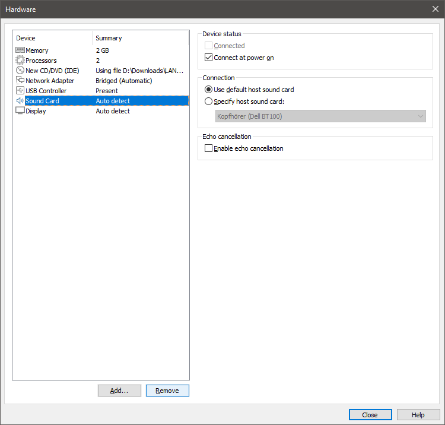
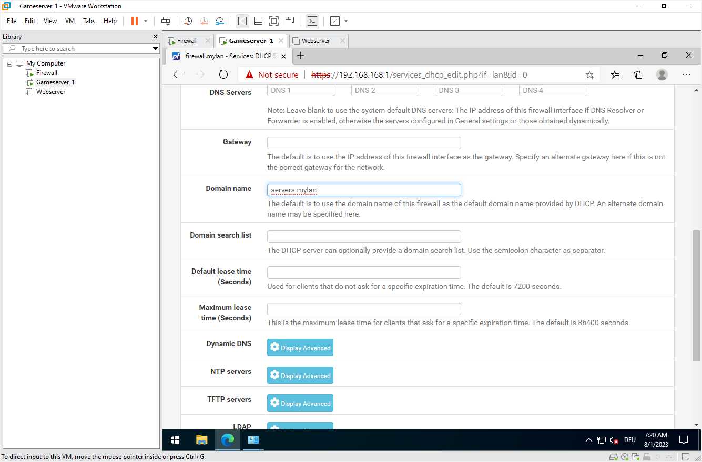
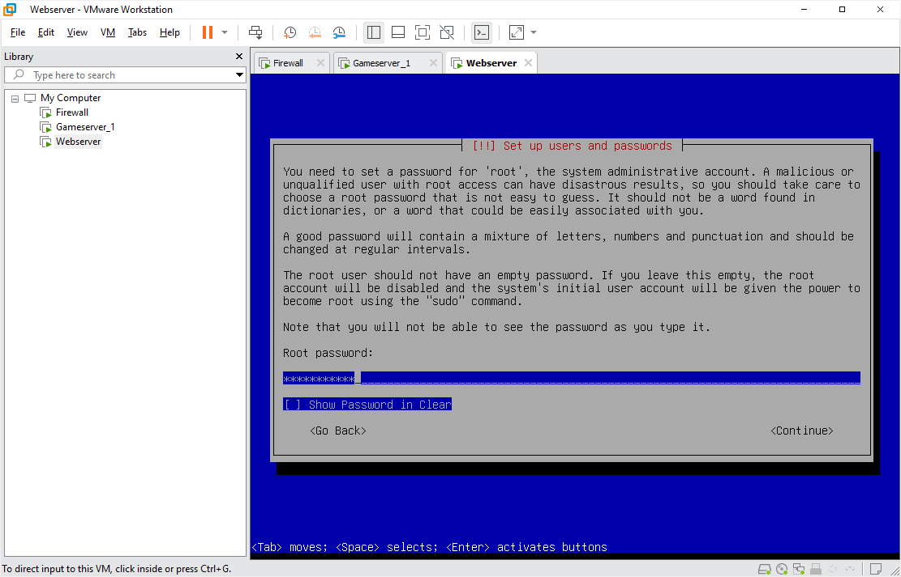

# eti LAN Guide
### Schritt für Schritt zu deinem eigenen LAN Party Server

Oft wurden wir gefragt: "Gibt es nicht eine Anleitung?" "Wie installiere ich das genau?" "Wie geht das nochmal mit diesem DNS?" Mit diesem Guide versuchen wir, einige der häufigsten Fragen zu beantworten. 

Du möchtest eine **LAN Party** veranstalten und weißt nicht, wo du anfangen sollst? Du hast schon Erfahrungen als Veranstalter und möchtest dein Setup nun optimieren und z.B. **Gameserver** bereit stellen? Dieser Guide kann dir helfen.

Bitte beachte, dass es sich bei dieser Anleitung um _einen möglichen_ Weg handelt. Es gibt mit Sicherheit noch bessere Ansätze oder bessere Software. Wir haben diese Anleitung jedoch so gestaltet, dass mit einem Minimum an Aufwand ein bestmögliches Ergebnis erreicht werden kann, ohne viele Einschränkungen zu schaffen. Wir versuchen dabei, die wichtigsten **Basics** zu vermitteln, die man für eine erfolgreiche LAN Party verinnerlicht haben sollte.

## Ausgangssituation

In dieser Anleitung gehen wir davon aus, dass du ein System einrichten möchtest, dass als **Server für deine LAN** dienen soll. Es ist erst einmal nicht so wichtig, ob diese Hardware schon bereit steht oder erst später beschafft werden soll. Sie muss lediglich **x86_64** -kompatibel sein. Da wir mit virtuellen Maschinen arbeiten, kannst du diese an deinem Windows-PC konfigurieren und später auf den Server übertragen.

### Vorschlag Netzdesign - mit Internet

Sollte **keine** Internetverbindung möglich oder diese schlicht nicht gewünscht sein, gestaltet sich das Netzdesign etwas einfacher. Es genügt **eine einzelne** Netzwerkkarte im Server. Sind mehr verfügbar, können sie als **Failover** oder **Link-Aggregation** genutzt werden.

### Vorschlag Netzdesign - nur LAN

Wir nutzen im Folgenden die Software **VMware Workstation**, um virtuelle Server anzulegen und auszuführen. Es ist dir überlassen, welche Schritte du bearbeiten möchtest, welche Dienste du einrichten möchtest und wo deine **virtuellen Server** später ausgeführt werden. Im Detail erklären wir folgendes:

 
## Vorgehen
**1. Installation VMware Workstation**

Wir zeigen in diesem Tutorial, wie VMware Workstation unter Windows konfiguriert wird. Auf deinem Server muss also irgendeine Windows-Version installiert sein, damit du die folgenden Schritte abarbeiten kannst.

> Alternativ kann auch eine andere Virtualisierungsumgebung oder VMware ESXi genutzt werden. Die Wahl fiel unter anderem auch deshalb auf VMware Workstation, da hier die Möglichkeit besteht, die virtuellen Server später zu exportieren und mit wenigen Klicks anzupassen.

**2. Konfiguration virtueller Netzwerkkarten**
> Möchtest du auch einen Internetzugang ermöglichen? Dann benötigt deine Serverhardware später 2 physische Netzwerkkarten. Anderenfalls genügt auch eine einzelne. 

**3. Installation einer pfSense Firewall**
> Aufspannen deines LANs, mit DHCP-Server, DNS-Forwarder und optionaler Internetanbindung.

**4. Installation eines Gameservers**

**5. Installation von LANPage**

Wenn alles eingerichtet ist, wird dein neues **LAN Party -Netz** in etwa so aussehen:

## Hardware
Diese Anleitung stellt keine allzu hohen Anforderungen an deine Hardware. Es hängt letztlich von deinem Konzept ab, wie viele virtuelle Server du benötigst und ausführen möchtest.  Wir können an dieser Stelle nur Empfehlungen aussprechen. Gehen wir beispielsweise davon aus, dass das Serversystem über folgende Ausstattung verfügt:

### Beispielhardware - alter Desktop PC
|Komponente|Produkt|Werte  
|-------|------|---------|
|CPU|Intel Core i5-2400|Cores: **4** Threads: **4**
|RAM|Samsung PC3-12800U|4 x **4 GB**
|Storage|Western Digital WD Red SSD|**1 TB**
|Storage|Seagate BarraCuda HDD|**2 TB**
|NIC|Realtek RTL8111E|10/100/**1000 Mbps**
|NIC|Broadcom BCM5751-T1|10/100/**1000 Mbps**
|Switch|D-Link DGS-108|8 Port

### Mögliche Ressourcenverteilung

> Diese Hardware würde schon eine halbwegs ansehnliche Ressourcenverteilung ermöglichen. Bitte beachte, dass es sich um ein individuelles Beispiel handelt und die Virtualisierungsebene bzw. das unter den VMs laufende Betriebssystem selbst auch ein paar Ressourcen benötigt.
> 
|VM|vCPUs|RAM|Storage|Typ|NIC|OS
|-------|------|---------|--------|-----|---|---|
|Firewall|1|1 GB|30 GB|SSD|2|pfSense (FreeBSD)
|Gameserver|2|8 GB|100 GB|SSD|1|Windows 10
|Sync Server|1|4 GB|2000 GB|HDD|1|Debian 12
|LANPage Webserver|1|0.5 GB|10 GB|HDD|1|Debian 12

## Vorbereitung

### Downloads
Für die nächsten Schritte benötigen wir einige Dateien, welche du schon einmal herunterladen kannst. Für die Testversionen von VMware ist unter Umständen eine Registrierung erforderlich - eine Wegwerf-Spamadresse genügt.

- **VMware Workstation** (Testversion): https://www.vmware.com/go/getworkstation-win
- **pfSense** (AMD64, DVD Image): https://www.pfsense.org/download
- **Debian 12** (AMD64, Netinstaller): https://www.debian.org/download
- **Windows 10** (64-Bit ISO Image): https://www.microsoft.com/de-de/software-download/windows10

Optional:
- **Windows Server** (64-Bit ISO Image): https://www.microsoft.com/de-DE/evalcenter/evaluate-windows-server-2022

### Installation VMware Workstation
Dieser Schritt gestaltet sich einfach: starte das soeben heruntergeladene VMware Workstation -Installationsprogramm und folge den Anweisungen.

Wenn du einen anderen Hypervisor verwenden möchtest (VMware ESXi, Hyper-V, VirtualBox, ...) kannst du die Installation überspringen. Achte darauf, dass deine Hardware mit dem Hypervisor kompatibel ist.

## Vorbereitung der Firewall-VM

Los geht's! In diesem Schritt erstellst du deinen ersten virtuellen Server: Eine **Firewall**. Die Firewall-VM kümmert sich um die Dienste DHCP sowie DNS und fungiert als Gateway für den Internetzugriff auf deiner LAN-Party (optional). Wir demonstrieren die Einrichtung anhand der Firewall-Distribution **PFsense**.

### Virtuellen Server erstellen ###

Öffne **VMware Workstation** und wähle über das Menü den Punkt **New Virtual Machine** oder drücke **STRG + N**.

Konfiguriere die VM nun, wie auf den folgenden Screenshots zu sehen:

#### Hinweis ####
Es empfiehlt sich, das Kompatiblitätslevel möglichst niedrig anzusetzen, da sich die VM damit später leichter auf einen ESXi-Server oder einen anderen Hypervisor übertragen lässt.

Wähle im nächsten Schritt das bereits heruntergeladene **pfSense ISO-Image** aus.

Gib der Firewall-VM einen passenden Namen. Die **Location** stellt den Speicherort der VM auf deinem Server dar. In unserem Beispiel verwenden wir eine der SSDs.

Die **CPU-Konfiguration** ergibt sich aus den zur Verfügung stehenden Ressourcen des Servers. Wir folgen auf dem Screenshot nicht ganz der Berechnung zu unserer Beispielhardware.

### Netzwerkkonfiguration der VM ###

Belasse den Netzwerktyp zunächst bei der Standardeinstellung, in einem der nächsten Schritte konfigurieren wir zuerst die Netzwerke des Hypervisors.

### Datenträgerkonfiguration der VM ###

Die Voreinstellungen können unserer Ansicht nach beibehalten werden.

Erstelle eine **virtuelle Festplatte** entsprechend der Screenshots. Bei der Angabe von **30 GB** handelt es um eine Empfehlung, sie darf selbstverständlich auch größer sein. Für die **Firewall** ist ein höherer Speicherplatzbedarf aber normalerweise nicht zu erwarten.

Wähle einen Speicherort für die virtuelle Festplatte. Normalerweise entspricht der Dateiname der Bezeichnung der VM und die **VMDK-Datei** wird im selben Verzeichnis abgelegt. Du solltest es hierbei belassen.

### Hardwareanpassungen ###

**Fertig!** Die VM ist nun vorkonfiguriert und du kannst nun weitere Anpassungen vornehmen. Eine Soundkarte wird für eine Firewall vermutlich nicht erforderlich sein. Benötigen werden wir jedoch eine weitere Netzwerkkarte.

Wähle hierzu **Add** und **Network Adapter**.

Die **VM** ist nun bereit für den ersten Start und die Installation der Firewall-Software. Bevor wir damit weiter machen, passen wir aber zunächst die **Netzwerkeinstellungen** der VMware Workstation (des Hypervisors) an. 

Solltest du einen anderen Hypervisor wie KVM, Hyper-V oder Virtualbox verwenden, musst du die **Adapterkonfiguration** analog zu den folgenden Anweisungen dort nachbilden.

> Selbstverständlich ist die Netzwerkkonfiguration auch abhängig vom gewünschten Setup. Dieses Tutorial behandelt ein gut funktionierendes Basissetup mit Internetzugang. Soll überhaupt kein Internet verteilt werden? Dann genügt für ein Basissetup auch ein Netzwerkadapter. Soll eine Lastverteilung oder ein Failover-Setup realisiert werden? Gibt es VLANs? Das weißt du sicher am besten. 

### Netzwerkkonfiguration (Hypervisor) ###

Öffne den **Virtual Network Editor** über das Menü **Edit**. Im Editor siehst du nun alle physischen und gegebenenfalls virtuelle Netzwerkkarten, die in deinem Server-Betriebssystem eingerichtet sind.

Wir gehen davon aus, dass eine Netzwerkkarte für **LAN** konfiguriert wird und eine für **WAN**, also den Internetzugang. Hier kann beispielsweise eine **Fritzbox**, ein **Kabelmodem** oder ein **LTE-Router** angeschlossen werden.

In VMware Workstation gibt es zwei grundlegende Netzwerkmodi: **NAT** (Network Address Translation) und **Bridge** (Netzwerk-Brücke). Hier eine kurze Erklärung, was die beiden Modi unterscheidet:

> ### NAT-Modus (Network Address Translation) ###
> 
> Hier erstellst du ein privates Netzwerk für die VMs.
> Die VMs teilen sich **eine** IP-Adresse des Hosts, um Verbindungen nach Außen aufzubauen. Nach Außen heißt in dem Fall: zum Rest des LAN oder WAN.
> Gut, wenn von einander isolierte VMs oder Internetzugriff für VMs gewünscht sind und keine IP-Adressen im LAN benutzt werden sollen. Die Performance ist jedoch geringer und NAT bringt im Regelfall weitere Probleme mit sich. Der Netzwerkmodus ist ungeeignet für eine Firewall.

> ### Bridge-Modus (Brückenmodus) ###
> 
> Im Bridge-Modus benimmt sich die VM wie ein eigener, physischer Rechner im Netzwerk. 
> Die VM erhält über die zufallsgenerierte MAC-Adresse ihrer virtuellen Netzwerkkarte eine eigene IP-Adresse und kann direkt mit anderen Geräten sprechen. Nützlich, wenn eine nahtlose Integration der VMs ins Netzwerk gewünscht ist, sehr gute Performance.

### Virtual Network Editor ###

Wähle für die beiden zu verwendenden Netzwerkadapter den **Bridged**-Modus aus. Sollte eine deiner Netzwerkkarten nicht erkannt beziehungsweise aufgeführt werden, musst du sie im **Windows Geräte-Manager** überprüfen. Beende anschließend den **Virtuel Network Editor** mit einem Klick auf **OK**.

### Netzwerkkonfiguration (Firewall VM) ###

Öffne mit einem Rechtsklick auf die VM unter dem Punkt **Settings** erneut das Konfigurationsmenü der VM.

Wähle den oder die Netzwerkadapter aus und konfiguriere auch hier den **Bridged**-Modus.

### Zusammenfassung ###

Die Hardwareausstattung der VM sollte nun wie folgt aussehen:

Das sieht gut aus! Zeit für den ersten Boot! Wähle **Power on this virtual machine**.
 

Wenn alles richtig konfiguriert ist, solltest du nach kurzer Zeit den **pfSense Installer** sehen können, der von dem in die VM eingehängten **ISO-Image** geladen wurde.

## Installation Firewall ##

Die nächsten Schritte sind recht unspektakulär. Folge den Anweisungen des **pfSense Installers** indem du die nächsten Punkte anhand der folgenden Screenshots abarbeitest. 

> Sollte sich heraus stellen, dass für die nächsten Teilschritte ausführliche Erklärungen erforderlich sind, werden wir sie nachpflegen.

Wähle **Accept** durch einfaches Drücken der **Eingabetaste** und im nächsten Menü anschließend **Install** durch Bestätigung von **OK**.

### Installation starten ###

### Partitionierung ###

#### Bestätigung ####

In diesem Schritt bestätigst du noch einmal, dass die **virtuelle Festplatte** der Firewall-VM formatiert werden darf.

### Kopiervorgang ###

Keine Sorge, du merkst schon, wenn es brennt 😛 Abwarten und Tee trinken.

Wenn der Kopiervorgang abgeschlossen ist, wähle **Reboot** um die VM neu zu starten.

## Konfiguration der Firewall ##

Wenn der Neustart der VM abgeschlossen ist, solltest du das **pfSense Wartungsmenü** sehen können. Hier können und müssen wir zunächst eine grundlegende Konfiguration der Netzwerkkarten vornehmen.

Bisher spielte es noch keine Rolle, an welche der beiden Netzwerkkarten in deinem Server, die Netzwerkkabel zum **LAN** oder **WAN** angeschlossen sind. Das wird sich nun ändern.

### LAN-Interface ###
Wähle die Option **1**, um den virtuellen Netzwerkkarten IP-Adressen zuzuweisen.

Fangen wir mit dem _LAN-Interface_ an. In unserer Übersicht ist das NIC **em1**. Demnach muss **2** ausgewählt werden, um **em1** zu konfigurieren. 

Bei der Frage ob die Netzwerkkarte mit DHCP konfiguriert werden soll, wählen wir **n**, denn stattdessen wollen wir unsere Firewall IP-Adressen verteilen lassen.

### IP-Bereich festlegen ###

**pfSense** fragt daraufhin nach einer IP-Adresse für sich selbst und dem dazugehörigen IP-Bereich.

Theoretisch funktionieren etliche private Adressbereiche:

|Typ|Bereich von|bis|
|-------|------|------|
|Klasse A|10.0.0.0|10.255.255.255|
|Klasse B|172.16.0.0|172.31.255.255|
|Klasse C|192.168.0.0|192.168.255.255|

In der Praxis hat sich jedoch gezeigt, dass manche Spiele mit IP-Bereichen aus _Klasse A_ oder _B_ nicht zurecht kommen oder diese im LAN-Modus gar blockieren. Wir empfehlen daher, einen IP-Bereich aus _Klasse C_ zu verwenden.

Der Bereich sollte außerdem _nicht_ identisch mit dem privaten Netzbereich deines Routers beziehungsweise Internetmodems sein.

### Adresse der Firewall ###
Wir verwenden in unserem Beispiel die IP **192.168.168.1** für die Firewall, woraus sich der IP-Bereich **192.168.168.0/24** ergibt.

### IPv6 ###

In deinem Netz wirst du **IPv6** vermutlich nicht benötigen. Du kannst **IPv6** konfigurieren, darauf gehen wir hier aber nicht weiter ein.

### DHCP-Server aktivieren ###

Bei der Nachfrage, ob wir den DHCP-Server im LAN einschalten wollen, bestätigen wir mit **y**, damit unsere Firewall IPs an die Clients verteilt.

Du kannst nun einen Bereich innerhalb des IP-Netzes angeben, aus dem Adressen an die Clients verteilt werden sollen.

### WAN-Interface ###

Die Netzwerkkarte **em0** konfigurieren wir zunächst nicht. Auf unserem Beispiel-Screenshot ist zu sehen, dass diese eine IP-Adresse **192.168.178.x** erhalten hat. Diese stammt von einer angeschlossenen Fritzbox, welche für den Internetzugang benutzt werden soll. Die Konfiguration von **em0** kann später im **Webinterface** der pfSense vorgenommen werden. Zunächst werden wir daher eine **Test-VM** einrichten, womit wir diese Konfigurationsoberfläche erreichen können. So kann außerdem geprüft werden ob der **DHCP-Server** und die anderen Einstellungen korrekt funktionieren.

## Installation Gameserver ##

Die **Test-VM** kann nach der Konfiguration der Firewall als **Gameserver** fungieren. Daher werden wir sie in den folgenden Schritten auch so bezeichnen. Du kannst natürlich auch ein anderes Testsystem benutzen, wenn du keinen Gameserver betreiben möchtest. Das Vorgehen bleibt zu einem Großteil identisch.

Erstelle nun eine neue VM und wähle das **Windows Server ISO-Image** für die Installation aus. Du kannst auch ein Windows 10 verwenden.

Folge den Anweisungen und passe die Vorgaben gegebenenfalls an. 

### Hardwareanpassungen ###

Plane etwas mehr Speicherplatz ein, wenn du mehrere Gameserver in einer VM betreiben möchtest. Die **virtuelle Festplatte** lässt sich aber auch nachträglich vergrößern.

### Alles korrekt? ###
Prüfe die Konfiguration noch einmal in der Zusammenfassung.

Wähle anschließend auch bei dieser VM den **Bridged**-Modus für die Netzwerkkarte.

Klicke auf **Edit virtual machine settings**, wenn du die VM nachträglich anpassen willst. Wenn alles passt, starte die VM.

### Windows-Setup ###

Das Windows-Logo sollte bald erscheinen, gefolgt von der **Windows Server Installationsroutine**.

Folge den Anweisungen und wähle eine passende Edition aus, die von deinen Lizenzen abhängt.

### Partitionierung ###

Wähle die gesamte virtuelle Festplatte zur automatisch Partitionierung.

Bitte warten...

>Langweilig oder? Dann lass uns doch gleich noch eine weitere VM erstellen!  Denn das dauert hier noch ein wenig und wir haben ja gerade so viel Übung darin.

## Weitere VM erstellen ##

Ein **Webserver** benötigt normalerweise nicht sehr viele Ressourcen und ist schnell eingerichtet. Mittels der **Webserver-VM** kannst du zum Beispiel **LANPage** betreiben und deinen Mitspielern ein Informationsportal anbieten. Du kannst diesen Schritt überspringen, wenn du keine solche VM betreiben möchtest.

Anderenfalls erstelle eine weitere VM und wähle das **Debian ISO-Image** aus.

Vergib auch hier wieder einen aussagekräftigen Namen.

Es genügt eine Minimalkonfiguration mit einem oder zwei CPU-Kernen.

**256 MB RAM** würden wahrscheinlich genügen, aber um Komplikationen zu vermeiden, vergebe mindestens **1 GB**.

Überlege, ob der Webserver künftig weitere Aufgaben übernehmen soll. **20 GB** sind aber mehr als ausreichend.

Wähle auch hier wieder den **Bridged**-Modus für die Netzwerkkarte. Starte die VM aber zunächst noch nicht. 

## pfSense Verwaltungsoberfläche ##

Kehre stattdessen zurück zu deiner **Gameserver-VM** und prüfe den Stand der Installation.

Wähle ein Passwort, wenn du bei der Anmeldemaske angekommen bist.

Beende den Server Manager, der sich daraufhin automatisch öffnet. Du kannst ihn auch gleich so konfigurieren, dass er nicht jedes Mal startet (Klick auf **Manage**).

### VMware Tools installieren ###

Dir wird sicherlich schon vor einer Weile der kleine Hinweis aufgefallen sein, den VMware Workstation am unteren Ende des VM-Fensters anzeigt. 

Es wird empfohlen, die **VMware Tools** zu installieren, um das Gastsystem mit virtuellen Treibern zu beschleunigen. Klicke dazu auf _I finished Installing_.

Die _VMware Tools_ werden daraufhin von der Workstation heruntergeladen und automatisch installiert. Wenn nicht, kannst du diesen Schritt auch wiederholen.

Öffne dazu einfach das Menü **VM** und wähle **Install VMware Tools**.

Belasse es bei Installationstyp **Typical**.

Sobald die Installation der Treiber abgeschlossen ist, öffne die Übersicht der Netzwerkverbindungen durch **Rechtsklick** auf das Icon neben der Lautstärkeregelung oder durch **Start** --> **cmd** und den Befehl:

>control netconnections ncpa.cpl

Wenn bis hierhin alles geklappt hat, sollte die **Gameserver VM** eine IP-Adresse von der **Firewall** erhalten haben. Ist das nicht der Fall, stimmt vermutlich die Reihenfolge der Netzwerkkabel am Server nicht mit der Auswahl von **LAN** und **WAN** überein. Das würde sich aber auch dadurch bemerkbar machen, dass auf dem Server auf dem **VMware Workstation** läuft, die Internetverbindung nun nicht mehr funktioniert. Tausche in diesem Fall einmal die beiden Netzwerkkabel und starte die **Firewall-VM** neu, gefolgt von der **Gameserver-VM**.

Prüfe nun erneut die IP der **Gameserver-VM**. Hat sie eine Verbindung? Super! Dann öffne nun einen Browser. Der integrierte **Edge Browser** dürfte für unsere Zwecke genügen.

Nun ist es Zeit, die Konfigurationsoberfläche der **pfSense Firewall** zu öffnen. Rufe dazu die IP-Adresse mittels **https://** auf, die du im Abschnitt **LAN-Interface** festgelegt hast. Also beispielsweise:

>https://192.168.168.1

und bestätige die Zertifikatsfehlermeldung aufgrund der selbsterstellen **Certification Authority (CA)** der pfSense mit einem Klick auf **Continue to ... (unsafe)**.

Die Standardzugangsdaten lauten:

>Benutzer:	admin

>Password:	pfsense

Du solltest nun den Installationsassistenten durchlaufen, um eine Grundkonfiguration der **pfSense** vorzunehmen.

Wähle einen **Hostnamen** und eine **Domain**. Theoretisch wäre hier jede erdenkliche Kombination möglich, es empfiehlt sich jedoch, eine Fake-Domain zu verwenden. Der **DHCP-Server** der pfSense wird diese Informationen an die Clients verteilen und die Weboberfläche unter der Kombination aus beidem erreichbar machen, also zum Beispiel:

> https://firewall.mylan

Bestätige im nächsten Schritt den vorgegebenen Zeitserver oder wähle einen anderen, zum Beispiel **fritz.box**, wenn du einen entsprechenden Router hast oder **time.google.com** für einen öffentlichen NTP-Server.

> Ein Zeitserver ist relevanter als du vielleicht denkst. Eine zu stark von anderen Systemen abweichende Systemzeit kann in der Kommunikation der Teilnehmer zu Servern oder untereinander zu verschiedensten Problemen führen.

Prüfe nun bei **Schritt 4** noch einmal die Konfiguration des DHCP-Servers.

Und anschließend bei **Schritt 5**...

...die Konfiguration der Firewall-IP...

...sowie das von dir gewählte Passwort.

Klicke auf **Reload** um die Konfiguration zu speichern und die **Firewall** neu zu starten.

Nach dem Neustart der **Firewall-VM** solltest du nun das **Dashboard** sehen können.

Überprüfe, ob die IP-Adressen für **LAN** und **WAN** korrekt sind und ob das **Gateway** einer IP-Adresse aus dem IP-Bereich deines Routers entspricht.

Öffne oben im Navigationsmenü den Bereich **Services** --> **DHCP Server**.

Sofern noch nicht vorhanden, ergänze im Feld **DNS Servers** die IP-Adresse deiner Firewall.

Du kannst nun auch noch einmal die anderen Einstellungen überprüfen.

### DNS Suchliste ###

Beachte auch die **Domain search list**. Was ist das? Ganz einfach:

Der DHCP-Server teilt den Clients sowohl eine Domain mit, als auch eben jene Domain-Suchliste. Die Clients werden mit ihrem Hostname unter der Hauptdomain verfügbar gemacht. In unserem Beispiel wäre das also zum Beispiel **ClientPC2**, der nach Erhalt einer IP-Adresse unter:

>**ClientPC2.clients.mylan**

erreichbar wird. Versuchst du zum Beispiel, einen Client anzupingen oder eine andere Anfrage an diesen zu senden, wird das Betriebssystem zunächst versuchen, diesen über eine Domain in der Suchliste zu erreichen - und zwar in angegebener Reihenfolge.

Das steigert zum einen die Performance, indem es Antwortzeiten und Suchanfragen minimiert und veraltete Netbios-Broadcasts vermeidet. Zum anderen lässt sich die Funktion nutzen, um zum Beispiel alle Gameserver unter einer Subdomain erreichbar zu machen, was für einige bestimmte Titel auch benötigt wird, während alle Rechner der Teilnehmer generell eine andere DNS-Domain haben.

### DNS Server ###

Einen **vollständigen** DNS-Server zu betreiben kann ein recht aufwendiges Unterfangen sein. Für unser Vorhaben beschränken wir uns auf den **DNS Forwarder** der pfSense. Der Forwarder leitet alle **DNS-Anfragen** an andere DNS-Server weiter, es sei denn, die gewünschte Adresse ist ihm bereits bekannt (Cache) oder es ist ein Eintrag in seiner lokalen Liste hinterlegt. Das genügt für unsere Anforderungen.

Öffne das Konfgurationsmenü unter **Services** --> **DNS Forwarder**.

Übernehme die Einstellungen wie angegeben.

Solltest du beim Speichern der Einstellungen einen Fehler erhalten, deaktiviere zunächst den **DNS Resolver** der pfSense. Dieser ist für unsere LAN-Umgebung weniger geeignet.

Wechsel hierfür nach **Services** --> **DNS Resolver**. Nach dem du den Resolver deaktiviert und die Einstellung gespeichert hast, solltest du den **DNS Forwarder** aktivieren können.

### Test der Dienste

Du kannst nun noch einmal mit der Gameserver-VM überprüfen, ob **DHCP-Server** und **DNS-Forwarder** korrekt funktionieren.

Du erinnerst dich vielleicht noch an **Start** --> **cmd** und:

>control netconnections ncpa.cpl

Sollten die Parameter noch nicht so aussehen wie du sie in der pfSense konfiguriert hast, kannst du die VM neu starten oder mittels **Start** --> **cmd** und dem Befehl:

>ipconfig /release

den aktuellen **DHCP-Lease** vergessen und mittels:

>ipconfig /renew

einen neuen Lease vom **DHCP-Server** holen. Sollte es hier hapern, ein Neustart der VM kann helfen.

Sehr schön! Wir sind schon weit gekommen.

### Statische DHCP-Einträge

Auf der Einstellungsseite des DHCP-Servers gibt es noch einen interessanten Bereich, nämlich **DHCP Static Mappings**. Statische Einträge erlauben es, einem bestimmten System immer die selbe IP-Adresse zuzuweisen, was für unsere Server-VMs sehr hilfreich ist.

Die Zuweisung funktioniert anhand der MAC-Adresse (der VM).

Erstelle einen neuen Eintrag für die **Gameserver-VM**. Du kannst selbstverständlich auch einen anderen Namen oder eine andere Beschreibung angeben, wichtig ist nur dass du die korrekte MAC-Adresse deiner VM einträgst. Um diese zu erhalten kannst du mittels **Rechtsklick --> Properties** die Hardwarekonfiguration der VM aufrufen.

Beachte dass du unter **Domain name** eine abweichende Domain angeben kannst. Da es sich um einen Gameserver handelt, kannst du diesen zum Beispiel standardmäßig unter

>servers.mylan

anstatt

>clients.mylan

erreichbar machen.

Prüfe, ob der statische DHCP-Eintrag funktioniert, indem du erneut

>control netconnections ncpa.cpl

aufrufst oder das aktuelle **DHCP-Lease** verwirfst, wie im vorherigen Abschnitt beschrieben. Auf dem Screenshot ist zu erkennen, dass der fest definierte DNS-Suffix vom DHCP-Server übernommen wurde.

Wenn alles fertig konfiguriert ist, sollte die **pfSense** neben ihrer IP-Adresse zusätzlich auch über

> https://firewall.mylan

erreichbar sein.

### Und wieder VMware Tools

Auch die Firewall-VM benötigt die erweiterten Treiber der **VMware Tools** um korrekt zu funktionieren.

Um sie zu installieren, öffne das Menü **System** --> **Package Manager**,

suche nach VMware und installiere das Paket.

Starte die **Firewall-VM** anschließend neu. Entweder über **Diagnostics** --> **Reboot system** oder über **VMware Workstation**.

## Installation Webserver

Du hast dich dafür entschieden und eine Webserver-VM angelegt? Dann machen wir damit mal weiter.

### Debian Setup

Starte die VM und wähle im **Bootmenü** als erstes **Install**. Die grafische Installation empfiehlt sich nur, wenn man auch wirklich GUI-Programme ausführen möchte.

Folge den Anweisungen. Du kannst unsere Vorschläge natürlich anpassen (z.B. Tastatur-Layout und Sprache).

### Hostname konfigurieren

Wähle einen Hostname für deinen Webserver. Normalerweise entspricht dieser dem Namen unter welchem der Server später erreichbar sein soll. Das hindert uns natürlich nicht daran, den Webserver später via DNS unter weiteren Namen erreichbar zu machen. In unserem Beispiel wählen wir zunächst:

> web

als **Hostnamen** und

> mylan

als **Domain**, so dass sich **web.mylan** in Kombination ergibt.

### Zugangsdaten

Wähle ein **root**-Passwort. Das ist analog zum Windows-Setup das entsprechende Administrator-Konto.

### Partitionierung

Wenn du nicht weißt was du tust, folge genau den Anweisungen.

### Auswahl Spiegelserver

Bei den meisten Linux-Distributionen ist es üblich, einen **Spiegelserver** (Mirror) für Installation, Updates und Upgrades auszuwählen, welcher geografisch der eigenen Hardware am nächsten ist.

### Auswahl der Komponenten

Für unseren Webserver benötigen wir nur ein Minimalsystem. Wähle nur den **SSH server** aus, wenn dir **SSH** ein Begriff ist. Ansonsten kannst du auch diesen abwählen. Die **VMware Tools** (Open VM Tools) werden automatisch installiert, da der **Debian-Installer** erkennt, dass es sich um eine entsprechende VM handelt.

Der **Debian-Installer** sollte nun seine Arbeit verrichten. Während die Installation läuft, öffne in **VMware Workstation** die Hardwarekonfiguration der VM.

Wir benötigen auch hier wieder die **MAC-Adresse** der VM, um diese im **DHCP-Server** einzurichten.

### Statischer DHCP-Eintrag

Öffne wieder die Oberfläche der **pfSense** und wähle **Services** --> **DHCP Server** und gehe zu den **DHCP Static Mappings**. Füge einen neuen Eintrag hinzu und kopiere die **MAC-Adresse** der **Webserver-VM** in das Feld.

Passe die IP-Adresse gegebenenfalls an. **Hostname** und **IP-Adresse** sollten den Angaben der VM entsprechen.

Die fertige Konfiguration sollte in etwa so aussehen:

### Test DNS-Auflösung

Sobald das **Debian-Setup** abgeschlossen ist, solltest du den **Login screen** sehen können.

Prüfe nun zunächst von der **Windows-VM** aus, ob die Webserver-VM bereits erreichbar ist. Dazu genügt ein einfacher PING-Befehl.

>ping web.mylan

Wenn DHCP- und DNS-Server korrekt funktionieren, wird die Antwort in etwa so aussehen:

Sollte die Adresse korrekt aufgelöst werden, bedeutet das, dass **DHCP** und **DNS** korrekt funktionieren.

## Konfiguration Webserver

In diesem Abschnitt geht es um die Konfiguration des Webservers beziehungsweise um die Einrichtung von **LANPage**. Du kannst natürlich auch eine andere Website oder App (z.B. Wordpress) verwenden.

Melde dich zunächst an der **Webserver-VM** mit deinen Zugangsdaten an und führe den Befehl zum Aktualisieren der Software-Liste aus:

> apt update

mittels

> apt upgrade -y

kannst du die Updates anschließend automatisch installieren.

### Installation Abhängigkeiten

Installiere nun die für **LANPage** benötigten Pakete:

> apt install -y apache2 php-common php-sqlite3 php-curl php-gd php-mbstring php-xml wget curl

Die Pakete werden automatisch ausgewählt und weitere vorgeschlagen:

### Test Webserver

Nachdem der Vorgang abgeschlossen ist, kehre zunächst zurück zur **Windows-VM**. Gib nun deine Hostname-Domain-Kombination ein und versuche die Testseite zu öffnen.

Das Ergebnis sollte in etwa so aussehen:

### LANPage Download

Die eigentliche LANPage-Einrichtung gestaltet sich nun recht einfach. Es muss lediglich ein Script ausgeführt werden.

> wget -O - https://www.eti-lan.xyz/lanpage.sh | sh

Starte die VM wie angewiesen neu. **LANpage** sollte nun bereits funktionieren. Wechsel erneut zur **Windows-VM** und aktualisiere die Seite.

Um **LANPage** nun an deine Veranstaltung anzupassen, kannst du die Beispielkonfiguration bearbeiten. Verwende dafür folgende Befehle:

> cd /lan/eti_lanpage/
cp config.sample.php config.php
nano config.php

Es öffnet sich ein Nano-Editor in dem du die gewünschten Änderungen vornehmen kannst.

Bearbeite mit:

> nano launcher.ini

anschließend auch die Anpassungsdatei für den **LAN Launcher**.

### LANPage DNS-Eintrag

Damit die Teilnehmer und installierte **LAN Launcher** die Website und die Anpassungen finden können, braucht es noch einen speziellen **DNS-Eintrag**. Öffne hierzu noch einmal die **pfSense Verwaltungsoberfläche** und gehe zu **Services --> DNS Forwarder --> Edit Host Override**.

LAN Launcher versucht beim Start eine Datei **http://launcher.lan/launcher.ini** zu erreichen. Erstelle deshalb einen neuen **Host Override**-Eintrag mit:

**Host**
> launcher

und **Domain**
> lan

und passe die **IP-Adresse** an die Adresse deiner **Webserver-VM** an.

Du kannst prüfen ob alles funktioniert, in dem du die **launcher.ini** unter der angegebenen Adresse im Browser der **Gameserver-VM** aufrufst.

## Nacharbeiten

Da war doch noch was. Achja, eine **Gameserver-VM** ohne Games. Da **LAN Launcher** die Windows-Server-Editionen leider nicht unterstützt, kannst du **LAN Launcher** auf einem anderen **Windows PC** starten und Gameserver-Daten auf die **VM** kopieren.

### Gameserver-Dateien

Das funktioniert, in dem du einfach über die **Administrator-Standardfreigabe** auf den **virtuellen Datenträger** der **VM** zugreifst.

Öffne dazu einfach:

> \\\gameserver-name\c$

und melde dich mit den Zugangsdaten des **Administratorkontos** an. Du kannst nun Ordner anlegen und Daten zwischen den Systemen hin und her kopieren.

### Separate Gameserver-VMs

Manche Gameserver erfordern es, dass bestimmte **Ports** auf dem darunterliegenden System frei sind und nicht benutzt werden. Es ist also möglich, dass sich unterschiedliche Spiele ins Gehege kommen, wenn sie auf dem selben **Windows Server** ausgeführt werden.

Daher bestimmt die Möglichkeit, die bereits eingerichtete **Gameserver-VM** zu klonen.

In diesem Beispiel führt **Gameserver_2** beispielsweise drei unterschiedliche Dienste aus, die für einen **Titanfall 2**-Server benötigt werden.

Auch ein **DNS-Eintrag** wird benötigt, da das Spiel unter dieser Adresse nach einer **Serverliste** sucht:

Ohne DNS-Konfiguration lässt sich auch der **Titanfall 2**-Server nicht starten.

## Ende ##

Fertig! Das war's! Du hast nun hoffentlich alles am Laufen! 😃

Wir sind vorerst am Ende unseres Tutorials angekommen. In Zukunft werden wir die Anleitung weiter verbessern und dabei das Feedback aus der Community berücksichtigen.

Viel Spaß mit deinem neuen **LAN-Server** und bis bald!

Das ETI Team

