# eti LAN Guide
### Step-by-Step to Your Own LAN Party Server

We often get asked: "Isn't there a guide?" "How exactly do I install this?" "How does this work again with DNS?" With this guide, we try to answer some of the most common questions.

You want to host a **LAN Party** and don't know where to start? You already have experience as a host and now want to optimize your setup and, for example, provide **game servers**? This guide can help you.

Please note that this guide represents _one possible_ approach. There are certainly better methods or better software. However, we designed this guide so that you can achieve the best possible result with a minimum of effort, without creating many restrictions. We try to convey the most important **basics** that you should internalize for a successful LAN party.

## Initial Situation

In this guide, we assume that you want to set up a system that will serve as a **server for your LAN**. It's initially not so important whether this hardware is already available or will be procured later. It just needs to be **x86_64** compatible. Since we are working with virtual machines, you can configure these on your Windows PC and transfer them to the server later.

### Suggested Network Design - With Internet

This is what your network could look like: A router (e.g., Fritzbox), some cables, the server, a switch, and the gaming computers.

If **no** internet connection is possible or simply not desired, the network design becomes somewhat simpler. **A single** network card in the server is sufficient. If more are available, they can be used for **failover** or **link aggregation**.

### Suggested Network Design - LAN Only

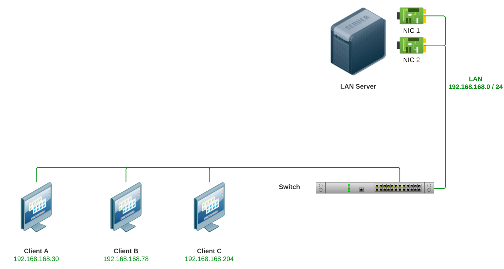

In the following, we use the software **VMware Workstation** to create and run virtual servers. It is up to you which steps you want to follow, which services you want to set up, and where your **virtual servers** will be executed later. In detail, we explain the following:

## Procedure
**1. Installation of VMware Workstation**

We show in this tutorial how VMware Workstation is configured under Windows. Some version of Windows must therefore be installed on your server so you can complete the following steps.

> Alternatively, another virtualization environment or VMware ESXi can be used. We chose VMware Workstation for several reasons, including the ability to easily export and adapt virtual servers later.

**2. Configuration of Virtual Network Cards**
> Do you also want to enable internet access? Then your server hardware will later need 2 physical network cards. Otherwise, one is sufficient.

**3. Installation of a pfSense Firewall**
> Set up your LAN, with DHCP server, DNS forwarder, and optional internet connection.

**4. Installation of a Game Server**

**5. Installation of LANPage**

Once everything is set up, your new **LAN Party network** will look something like this:

## Hardware
This guide does not place very high demands on your hardware. Ultimately, it depends on your concept, how many virtual servers you need and want to run. We can only make recommendations at this point. Let's assume, for example, that the server system has the following equipment:

### Example Hardware - Old Desktop PC
|Component|Product|Specifications  
|-------|------|---------|
|CPU|Intel Core i5-2400|Cores: **4** Threads: **4**
|RAM|Samsung PC3-12800U|4 x **4 GB**
|Storage|Western Digital WD Red SSD|**1 TB**
|Storage|Seagate BarraCuda HDD|**2 TB**
|NIC|Realtek RTL8111E|10/100/**1000 Mbps**
|NIC|Broadcom BCM5751-T1|10/100/**1000 Mbps**
|Switch|D-Link DGS-108|8 Port

### Possible Resource Allocation

> This hardware would already allow for a somewhat decent resource allocation. Please note that this is an individual example and the virtualization layer or the operating system running under the VMs itself also requires some resources.
> 
|VM|vCPUs|RAM|Storage|Type|NIC|OS
|-------|------|---------|--------|-----|---|---|
|Firewall|1|1 GB|30 GB|SSD|2|pfSense (FreeBSD)
|Gameserver|2|8 GB|100 GB|SSD|1|Windows 10
|Sync Server|1|4 GB|2000 GB|HDD|1|Debian 12
|LANPage Webserver|1|0.5 GB|10 GB|HDD|1|Debian 12

## Preparation

### Downloads
For the next steps, you will need to download some files. Registration might be required for trial versions of VMware - a disposable spam address should suffice.

- **VMware Workstation** (Trial Version): [VMware Workstation Download](https://www.vmware.com/go/getworkstation-win)
- **pfSense** (AMD64, DVD Image): [pfSense Download](https://www.pfsense.org/download)
- **Debian 12** (AMD64, Netinstaller): [Debian 12 Download](https://www.debian.org/download)
- **Windows 10** (64-Bit ISO Image): [Windows 10 Download](https://www.microsoft.com/de-de/software-download/windows10)

Optional:
- **Windows Server** (64-Bit ISO Image): [Windows Server Download](https://www.microsoft.com/de-DE/evalcenter/evaluate-windows-server-2022)

### Installation of VMware Workstation
This step is straightforward: Start the recently downloaded VMware Workstation installation program and follow the instructions.

If you would like to use a different hypervisor (VMware ESXi, Hyper-V, VirtualBox, ...), you can skip the installation. Make sure your hardware is compatible with the hypervisor you choose.

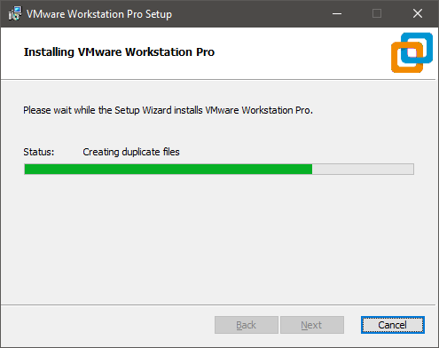

## Preparing the Firewall VM

Let's go! In this step, you will create your first virtual server: a **Firewall**. The Firewall VM handles DHCP and DNS services and serves as a gateway for internet access at your LAN party (optional). We demonstrate the setup using the Firewall distribution **pfSense**.

### Creating the Virtual Server ###

Open **VMware Workstation** and choose **New Virtual Machine** from the menu, or press **CTRL + N**.

Configure the VM as seen in the following screenshots:

#### Note ####
It's recommended to set the compatibility level as low as possible. This makes it easier to transfer the VM to an ESXi server or another hypervisor later.

Select the already downloaded **pfSense ISO Image** in the next step.

Give the Firewall VM an appropriate name. The **Location** represents the storage location of the VM on your server. In our example, we are using one of the SSDs.

The **CPU Configuration** depends on the available resources of the server. We do not strictly follow the calculation for our example hardware in the screenshot.

### Network Configuration of the VM ###

Initially, keep the network type at the default setting. In one of the next steps, we will first configure the networks of the hypervisor.

### Disk Configuration of the VM ###

In our opinion, the default settings can be maintained. The VMware **Paravirtualized SCSI** controller usually delivers better performance (especially under Windows; with registry adjustments), but compatibility is not always guaranteed with Linux or BSD-based operating systems as there simply is no driver.

Create a **Virtual Disk** according to the screenshots. The indicated **30 GB** is a recommendation; it can, of course, be larger. A higher storage space requirement is usually not expected for the **Firewall**.

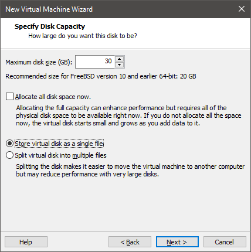

Choose a storage location for the virtual disk. The filename should correspond to the name of the VM, and the **VMDK file** should be stored in the same directory. So, you should keep it as suggested.

### Hardware Adjustments ###

**Done!** The VM is now pre-configured, and you can make further adjustments. A sound card will probably not be required for a Firewall. However, we will need an additional network card.

Select **Add** and **Network Adapter** for this.

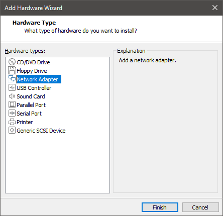

The mentioned, not required hardware like **Sound Card**, printer, floppy disk drive, etc., can be **highlighted** and removed by clicking **Remove**.

The **VM** is now ready for the first boot and the installation of the firewall software. Before we continue, we will adjust the **network settings** of VMware Workstation (the hypervisor).

If you are using a different hypervisor like KVM, Hyper-V, or Virtualbox, you will need to reproduce the **adapter configuration** there similarly to the following instructions.

> Of course, the network configuration also depends on the desired setup. This tutorial deals with a basic setup that works well with internet access. If you don't want to distribute the internet, a single network adapter will suffice for a basic setup. Do you want load balancing or a failover setup? Are there VLANs? You surely know best.

### Network Configuration (Hypervisor) ###

Open the **Virtual Network Editor** via the **Edit** menu. In the editor, you will now see all physical and possibly virtual network cards that are set up in your server operating system.

We assume that a network card for **LAN** is configured accordingly to the sketch and one for **WAN**, i.e., Internet access. For example, a **Fritzbox**, **Cable Modem**, or **LTE Router** can be connected here.

In VMware Workstation, there are two basic network modes: **NAT** (Network Address Translation) and **Bridge** (Network Bridge). Here is a brief explanation of what distinguishes the two modes:

> ### NAT Mode (Network Address Translation) ###
> 
> Here you create a private network for the VMs.
> The VMs share **one** IP address of the host to establish connections to the outside. Outside means, in this case, to the rest of the LAN or WAN.
> Good if isolated VMs or internet access for VMs are desired and no IP addresses in the LAN should be used. However, performance is lower, and NAT usually brings additional problems. The network mode is unsuitable for a firewall.

> ### Bridge Mode (Bridged Mode) ###
>
> In Bridge Mode, the VM behaves like its own physical machine on the network.
> The VM receives its own IP address via the randomly generated MAC address of its virtual network card and can speak directly with other devices. Useful when seamless integration of the VMs into the network is desired; very good performance.

### Virtual Network Editor ###

Choose the **Bridged** mode for the two network adapters to be used. If one of your network cards is not recognized or listed, you must check it in the **Windows Device Manager**. Then close the **Virtual Network Editor** by clicking **OK**.

### Network Configuration (Firewall VM) ###

Open the configuration menu of the VM again with a right-click on the VM under the point **Settings**.

Select the network adapter(s) and also configure the **Bridged** mode here.

### Summary ###

The hardware configuration of the VM should now look like this:

Looks good! Time for the first boot! Choose **Power on this virtual machine**.

If everything is correctly configured, you should see the **pfSense Installer** after a short time, which was loaded from the **ISO image** mounted into the VM.

## Firewall Installation ##

The next steps are quite unspectacular. Follow the instructions of the **pfSense Installer** by working through the next points based on the following screenshots.

> If it turns out that detailed explanations are required for the next sub-steps, we will add them later.

Select **Accept** by simply pressing **Enter** and in the next menu then **Install** by confirming with **OK**.

### Start Installation ###

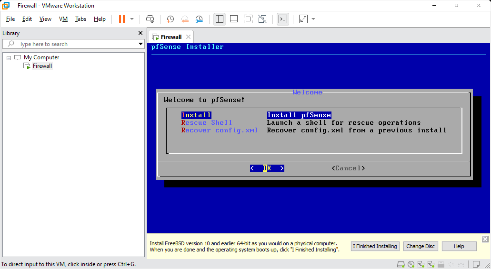

### Partitioning ###

#### Confirmation ####

In this step, you confirm once again that the **virtual hard disk** of the Firewall VM may be formatted.

### Copying Process ###

Don't worry, you'll notice when it burns 😛 Wait and drink tea.

When the copying process is completed, select **Reboot** to restart the VM.

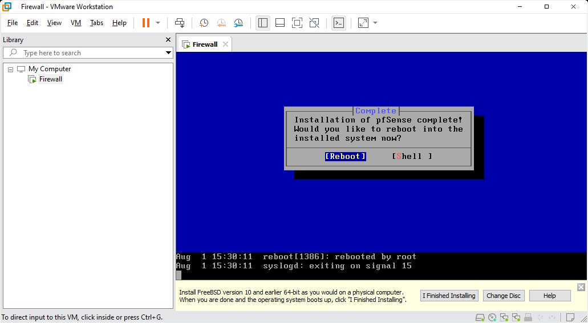

## Firewall Configuration ##

Once the VM reboot is complete, you should be able to see the **pfSense Maintenance Menu**. Here, we must initially configure the network cards.

Up until now, it hasn't mattered which of the two network cards in your server the network cables to the **LAN** or **WAN** are connected. This is about to change.

### LAN Interface ###

Select option **1** to assign IP addresses to the virtual network cards.

Let's start with the **LAN interface**. In the screenshot, the network card (Network Interface Controller, NIC) is **em1**. Therefore, you have to select **2** to configure **em1**.

When asked whether the network card should be configured with DHCP, we select **n**, because we want our firewall to distribute IP addresses instead.

> It may be that the network card **em1** is connected with a cable that currently goes directly to the **router** instead of the **switch**. The **LAN** that **pfSense** sets up would then not be accessible from a computer also connected to the switch. Therefore, the cable at the server needs to be **swapped** (changed).

> This issue is generally noticeable early on when the **pfSense maintenance interface** is displayed for the first time. Has **pfSense** already received an **IP address** for **em0** or **em1** without any action on your part? This probably comes from the network of the connected **internet router**. This would automatically make this **NIC** the **WAN interface** (which you can change by swapping cables).

### Define IP Range ###

**pfSense** then asks for an IP address for itself and the corresponding IP range.

Several private address ranges theoretically work:

| Type  | Range Start | Range End       |
|-------|------------|-----------------|
| Class A | 10.0.0.0  | 10.255.255.255  |
| Class B | 172.16.0.0| 172.31.255.255  |
| Class C | 192.168.0.0|192.168.255.255 |

However, experience has shown that some games do not work well with IP ranges from **Class A** or **B** or even block these in **LAN mode**. We, therefore, recommend using an IP range from **Class C**.

The range should also **not** be identical to the private network range of your router or internet modem.

### Firewall Address ###
In our example, we use the IP **192.168.168.1** for the firewall, resulting in the IPv4 network **192.168.168.0/24**.

### IPv6 ###

You probably won't need **IPv6** in your network, as most (not necessarily older) games couldn't care less about the network protocol. You can configure **IPv6**, but we won't go into it further here.

### Activate DHCP Server ###

When asked whether we want to enable the **DHCP Server** in the **LAN**, we confirm with **y**, so our firewall distributes IP addresses to clients (or servers).

You now need to specify a range within the IP network from which addresses for distribution should be selected.

### WAN Interface ###

We initially do not configure the network card **em0**. The example screenshot shows that it has received an IP address **192.168.178.x**. This comes from a connected Fritzbox, which should be used for internet access. The configuration of **em0** can be carried out later in the **Web interface** of **pfSense**. First, we will set up a **Test VM**, with which we can access this **configuration interface**. This also allows us to check whether the **DHCP server** and other settings are working correctly.

## Gameserver Installation ##

The **Test VM** can act as a **gameserver** after configuring the firewall. Therefore, we will refer to it as such in the following steps. You can, of course, use another test system if you do not want to operate a gameserver. The procedure remains largely identical.

Now create a new VM and select the **Windows Server ISO image** for installation. You can also use **Windows 10** or **11** as the operating system for your server. Here, however, you will need to adjust the **power saving settings** to prevent the VM from _falling asleep_.

Follow the instructions and adjust the specifications as needed.

### Hardware Adjustments ###

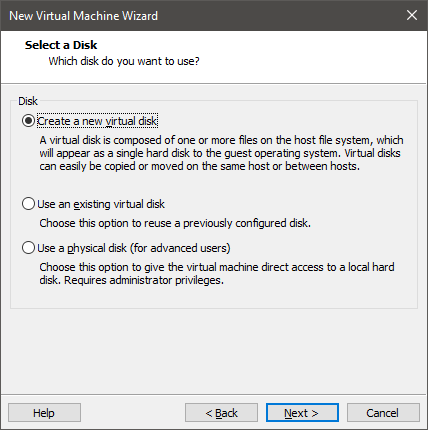

Plan for more storage space if you want to operate several gameservers in one VM. However, the **virtual disk** can also be enlarged later.

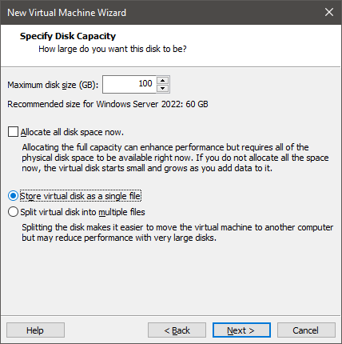

### All Correct? ###
Review the configuration once again in the summary.

Then also choose the **Bridged** mode for the network card in this VM and remove any unnecessary hardware.

Click on **Edit virtual machine settings** if you want to adjust the VM afterwards. If everything fits, start the VM.

### Windows Setup ###

The Windows logo should appear soon, followed by the **Windows Server Installation Routine**.

Follow the instructions and choose an appropriate edition, depending on your licenses.

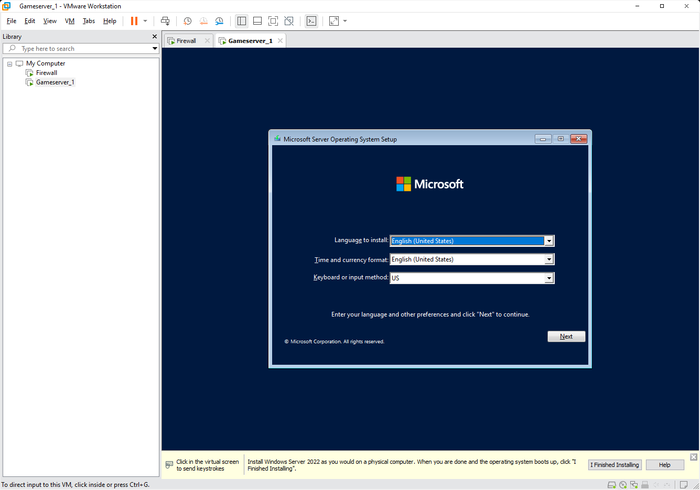

### Partitioning ###

Select the entire virtual disk for automatic partitioning.

Please wait...

> Boring, right? Then let's create another VM right now! Because this is going to take a while, and we've just gotten so much practice.

## Create Another VM ##

A **Web server** usually doesn't require many resources and is quickly set up. Using the **Web server VM**, you can run **LANPage** for example, and offer an information portal to your fellow players. You can skip this step if you don't want to operate such a VM.

Otherwise, create another VM and select the **Debian ISO image**.

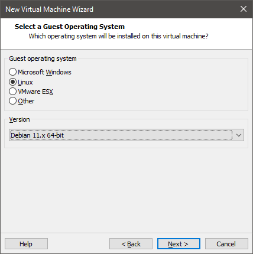

Again, assign a meaningful name.

A minimal configuration with one or two CPU cores is sufficient.

**256 MB of RAM** would probably suffice, but to avoid complications, allocate at least **1 GB**.

Consider whether the web server will take on more tasks in the future. Otherwise, **20 GB** would be more than enough.

Again, choose the **Bridged** mode for the network card. However, do not start the VM yet.

## pfSense Management Interface ##

Instead, return to your **Game server VM** and check the installation status.

Choose a password when you have reached the login screen.

Close the **Server Manager**, which will automatically open. You can also configure it so it does not start every time (click on **Manage**).

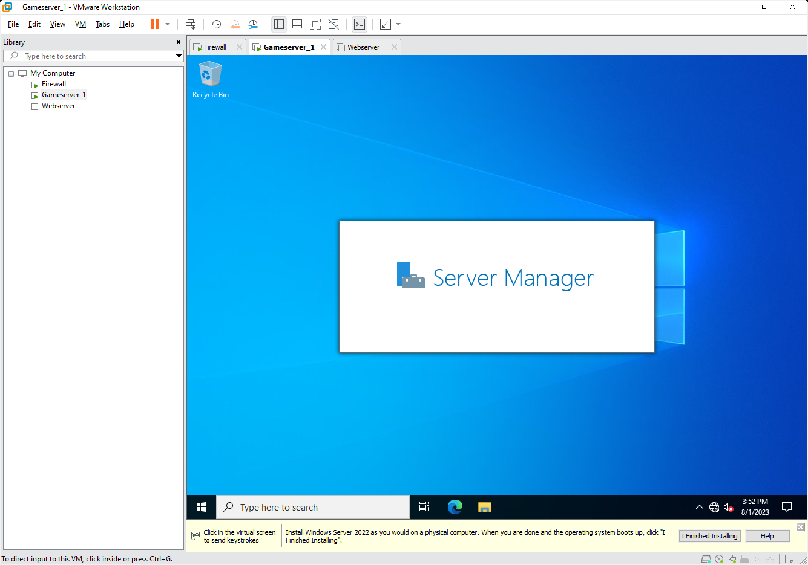

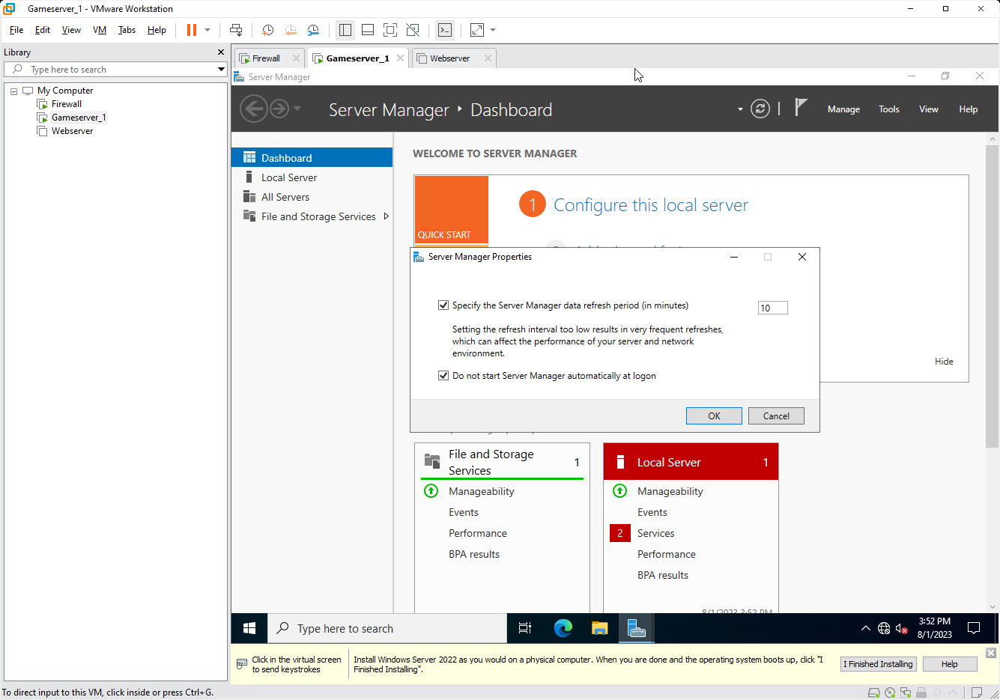

### Installing VMware Tools ###

You've probably noticed a small notice at the bottom of the VM window in VMware Workstation.

It is recommended to install **VMware Tools** to boost the guest system with virtual drivers. To do this, click on **I finished Installing**.

VMware Workstation will download and automatically install **VMware Tools**. If this doesn't happen, you can repeat this step.

Open the **VM** menu and select **Install VMware Tools**.

Leave the installation type as **Typical**.

Once the driver installation is complete, open the network connections overview by right-clicking the icon next to the volume control, or go to **Start --> cmd** and enter the command:

> control netconnections ncpa.cpl

If everything has worked up to this point, the **GameServer VM** should have received an IP address from the **Firewall**. If that is not the case, the order of the network cables at the server probably does not match the **LAN** and **WAN** selection. In this case, switch the two network cables and restart the **Firewall VM**, followed by the **GameServer VM**.

Check the IP of the **GameServer VM** again. If it's connected, great! Now open a browser. The built-in **Edge Browser** should suffice for our purposes.

It's now time to open the pfSense Firewall's configuration interface. To do this, go to the IP address you set in the **LAN-Interface** section, for example:

> https://192.168.168.1

And confirm the certificate error message due to the self-signed **Certification Authority (CA)** of pfSense by clicking **Continue to ... (unsafe)**.

The default login details are:

> User: admin
> Password: pfsense

You should now run through the installation wizard to perform basic configuration of **pfSense**.

Choose a **Hostname** and a **Domain**. Theoretically, any combination is possible here, but it's advisable to use a fake domain. The **DHCP Server** of pfSense will distribute this information to the clients, and the web interface will be accessible under this combination, such as:

> https://firewall.mylan

In the next step, confirm the pre-set time server or choose another one, such as **fritz.box** if you have a corresponding router, or **time.google.com** for a public NTP server.

> A time server is more relevant than you might think. A system time that deviates too much from other systems can cause various problems in the communication between participants to servers or among themselves.

Check the DHCP server's configuration at **Step 4**.

And then at **Step 5**...

...check the **Firewall IP** configuration...

...and the password you chose.

Click on **Reload** to save the configuration and restart the **Firewall**.

After restarting the **Firewall VM**, you should now be able to see the **Dashboard**.

Check if the IP addresses for **LAN** and **WAN** are correct, and if the **Gateway** corresponds to an IP address from your router's IP range.

Open **Services --> DHCP Server** in the top navigation menu.

If not already present, add your Firewall's IP address in the **DNS Servers** field.

You can also check the other settings once more.

### DNS Search List ###

What is the **Domain Search List**? It's quite simple:

The DHCP server provides both a domain and a domain search list to the clients. The clients will be made available under the main domain with their hostname. In our example, this would be **ClientPC2**, who, after receiving an IP address, would be accessible at:

> **ClientPC2.clients.mylan**

When you try to ping a client or send another request to it, the operating system will first attempt to reach it via a domain on the search list, in the given order.

This improves performance by minimizing response times and search queries, and avoiding outdated NetBIOS broadcasts. It can also be used, for example, to make all game servers accessible under a subdomain, which is required for some specific titles, while all participant machines have a different DNS domain.

### DNS Server ###

Operating a **full-fledged** DNS server can be quite a challenging endeavor. For our purposes, we will stick to pfSense's **DNS Forwarder**. The forwarder sends all **DNS queries** to other DNS servers unless the desired address is already known to it (cache) or there is an entry in its local list. This is sufficient for our needs.

Open the configuration menu under **Services** --> **DNS Forwarder**.

Adopt the settings as indicated.

If you receive an error when saving the settings, first deactivate pfSense's **DNS Resolver**, as it is less suitable for our LAN environment.

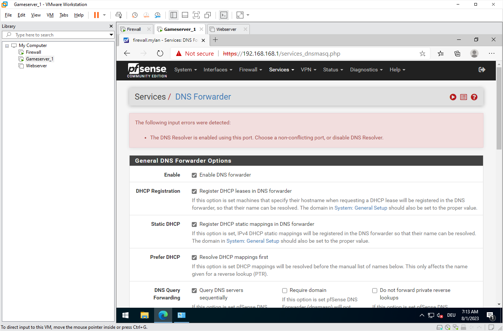

To do this, go to **Services** --> **DNS Resolver**. After you've deactivated the resolver and saved the setting, you should be able to activate the **DNS Forwarder**.

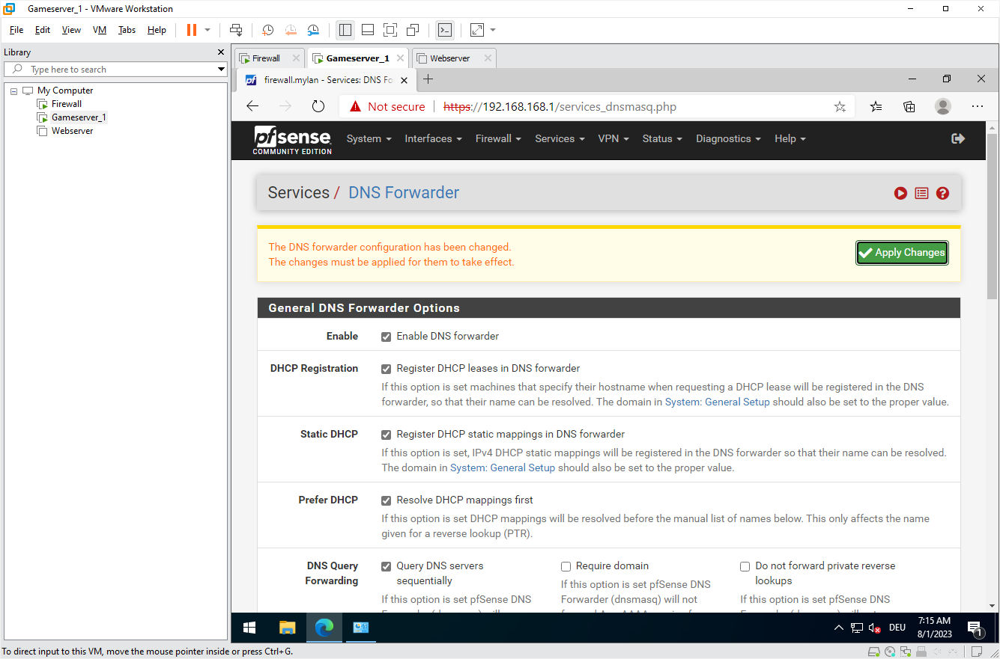

### Test the Services ###

You can now once again check with the GameServer VM to see if the **DHCP Server** and **DNS Forwarder** are working correctly.

You may remember **Start** --> **cmd** and:

> control netconnections ncpa.cpl

If the parameters don't yet look as you configured them in pfSense, you can restart the VM or use **Start** --> **cmd** and the command:

> ipconfig /release

to forget the current **DHCP Lease**, and then:

> ipconfig /renew

to get a new lease from the **DHCP Server**. If there are any hiccups here, restarting the VM can help.

Very good! We have come a long way.

### Static DHCP Entries ###

On the DHCP server's settings page, there is another interesting section called **DHCP Static Mappings**. Static entries allow you to assign the same IP address to a specific system each time, which is very helpful for our server VMs.

The assignment is done based on the MAC address (of the VM).

Create a new entry for the **Game Server VM**. Of course, you can also specify a different name or description, the important thing is that you enter the correct MAC address of your VM. To get this, you can access the VM's hardware configuration via **Right-click --> Properties**.

Note that you can specify a different domain under **Domain name**. Since it's a game server, you could make it accessible by default under:

> servers.mylan

instead of

> clients.mylan

Verify that the static DHCP entry is working by running

> control netconnections ncpa.cpl

again or by releasing the current **DHCP Lease** as described in the previous section. The screenshot shows that the hard-coded DNS suffix has been adopted by the DHCP server.

When everything is fully configured, **pfSense** should be accessible not only by its IP address but also at:

> **https://firewall.mylan**

### VMware Tools Again ###

The Firewall VM also requires the advanced drivers of **VMware Tools** to function correctly.

To install them, open the **System** --> **Package Manager** menu,

search for **VMware** and install the **Open-VM-Tools** package.

Then restart the **Firewall VM**, either via **Diagnostics** --> **Reboot system** or through **VMware Workstation**.

## Webserver Installation ##

You've decided and set up a **Web Server VM**? Let's continue with that.

### Debian Setup ###

Start the VM and select **Install** first in the **Boot menu**. A graphical installation is only recommended if you actually want to run GUI programs.

Follow the instructions. You can, of course, customize our suggestions (e.g., keyboard layout and language).

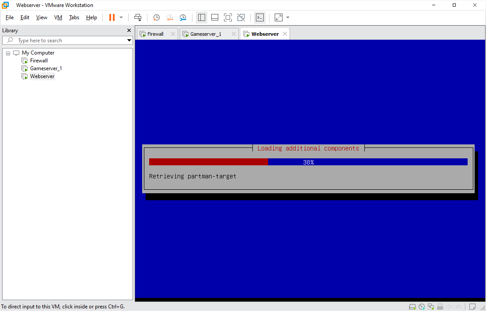

### Configuring Hostname ###

Choose a hostname for your web server. Normally, this would correspond to the name under which the server will be accessible later. Of course, that doesn't prevent us from making the web server accessible under additional names via DNS later. In our example, we initially choose:

> web

as the **hostname** and

> mylan

as the **domain**, so that **web.mylan** is formed in combination.

### Access Data ###

Choose a **root** password. This is analogous to the Windows setup's administrator account.

### Partitioning ###

If you don't know what you're doing, follow the instructions exactly.

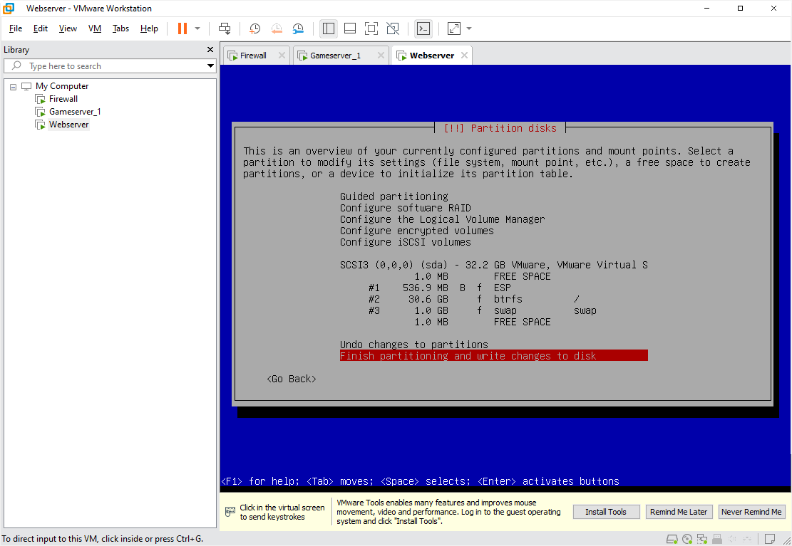

### Select Mirror Server ###

For most Linux distributions, it is customary to select a **mirror server** for installation, updates, and upgrades that is geographically closest to your hardware.

### Component Selection ###

For our web server, we only need a minimal system. Only select the **SSH server** if you're familiar with **SSH**. Otherwise, you can deselect this as well. The **VMware Tools** (Open VM Tools) are automatically installed because the **Debian Installer** recognizes that this is a corresponding VM.

The **Debian Installer** should now do its work. While the installation is running, open the hardware configuration of the VM in **VMware Workstation**.

We also need the **MAC address** of the VM here to set it up in the **DHCP server**.

### Static DHCP Entry ###

Open the interface of **pfSense** again and choose **Services** --> **DHCP Server** and go to **DHCP Static Mappings**. Add a new entry and copy the **MAC address** of the **Web Server VM** into the field.

Adjust the IP address as necessary. The **Hostname** and **IP address** should match the VM's information.

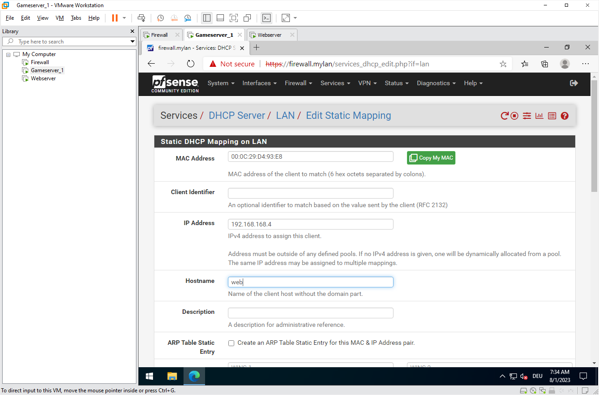

The final configuration should look something like this:

### Test DNS Resolution ###

Once the **Debian Setup** is complete, you should be able to see the **Login screen**.

Now, initially check from the **Windows VM** whether the web server VM is already accessible. For this, a simple PING command will suffice.

>ping web.mylan

If the DHCP and DNS servers are working correctly, the response will look something like this:

If the address is resolved correctly, it means that **DHCP** and **DNS** are functioning correctly.

## Web Server Configuration

This section is about configuring the web server, specifically setting up **LANPage**. Of course, you can also use another website or app (e.g., WordPress).

First, log in to the **Web Server VM** with your credentials and run the command to update the software list:

> apt update

then you can automatically install the updates using:

> apt upgrade -y

### Install Dependencies

Now install the packages required for **LANPage**:

> apt install -y apache2 php-common php-sqlite3 php-curl php-gd php-mbstring php-xml wget curl

The packages are automatically selected, and additional packages are suggested:

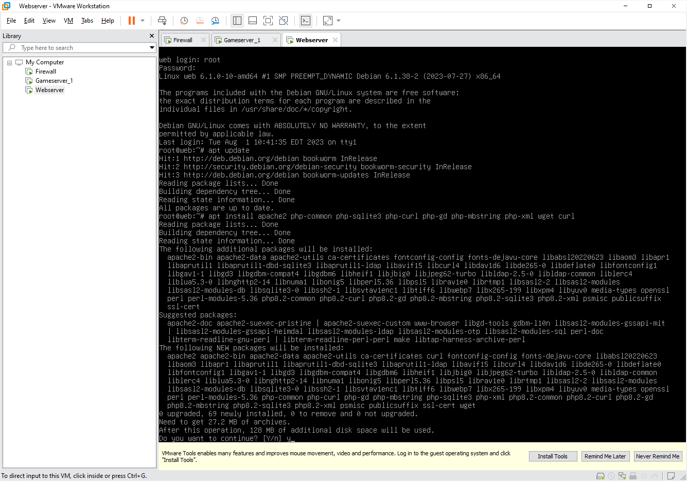

### Web Server Test

After the process is completed, return to the **Windows VM**. Enter your hostname-domain combination and try to open the test page.

The result should look something like this:

### LANPage Download

The actual **LANPage** setup is now quite simple. You just have to run a script.

> wget -O - **https://www.eti-lan.xyz/lanpage.sh** | sh

Reboot the VM as instructed. **LANPage** should now be functioning. Switch back to the **Windows VM** and refresh the page.

To customize **LANPage** for your event, you can edit the **sample configuration**. Use the following commands for this:

> cd /lan/eti_lanpage/  
cp config.sample.php config.php  
nano config.php

A Nano editor will open, where you can make the desired changes.

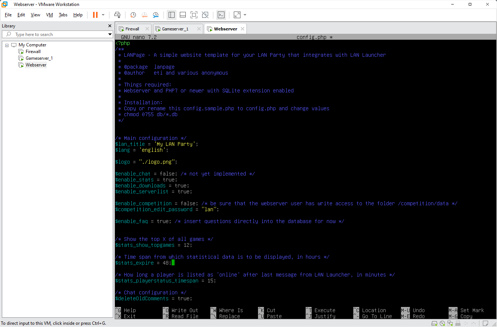

Edit with:

> nano launcher.ini

the subsequent customization file for the **LAN Launcher** as well.

### LANPage DNS Entry

To allow participants and the installed **LAN Launcher** to find the website and the customizations, a special **DNS entry** is required. To do this, open the **pfSense management interface** again and go to **Services --> DNS Forwarder --> Edit Host Override**.

Upon startup, LAN Launcher tries to access a file **http://launcher.lan/launcher.ini**. Therefore, create a new **Host Override** entry with:

**Host**
> launcher

and **Domain**
> lan

and adjust the **IP Address** to match the address of your **Web Server VM**.

You can verify if everything is working by accessing the **launcher.ini** at the specified address in the browser of the **Game Server VM**:

> **http://launcher.lan/launcher.ini**

## Follow-Up Work

Wait, something's missing. Oh yes, a **Game Server VM** without games. Since **LAN Launcher** unfortunately doesn't support Windows Server editions, you can start **LAN Launcher** on a different **Windows PC** and copy game server data to the **VM**.

### Game Server Files

This can be done by simply accessing the **virtual disk** of the **VM** via the **Administrator's default share**.

Just open:
> **\\\\gameserver-name\\c$**

and log in with the credentials of the **Administrator account**. You can now create folders and copy data between the systems.

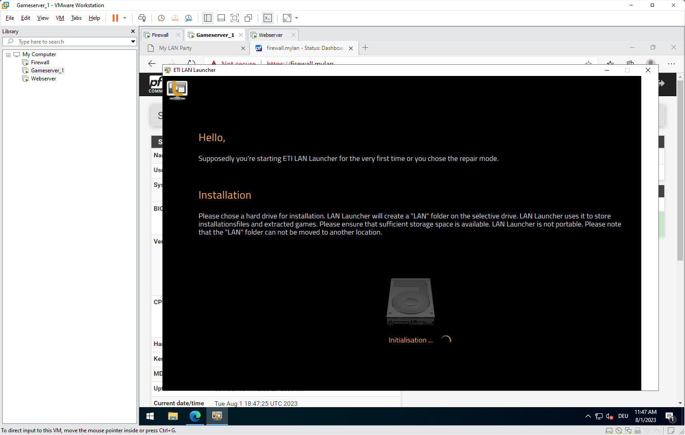

### Separate Game Server VMs

Some game servers require that specific **ports** on the underlying system are free and not in use. So it's possible that different games might interfere with each other if they are run on the same **Windows Server**.

Therefore, there is the option to clone the already set up **Game Server VM**.

In this example, **Gameserver_2** runs three different services needed for a **Titanfall 2** server.

Another **DNS entry** is also required, as the game looks for a **server list** under this address:

Without DNS configuration, the **Titanfall 2** server also won't start.

## End ##

Done! That's it! Hopefully, you have everything up and running now! 😃

We have reached the end of our tutorial for now. In the future, we will continue to improve the guide and take into account feedback from the community.

Have fun with your new **LAN Server**, and see you soon!

The ETI Team

